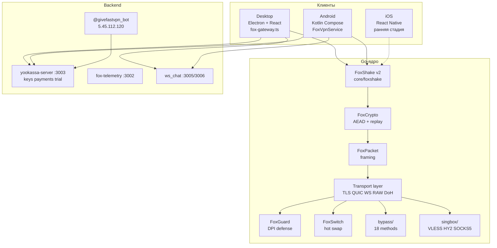
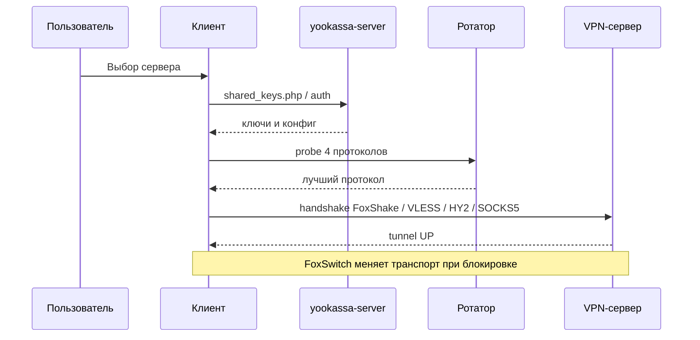
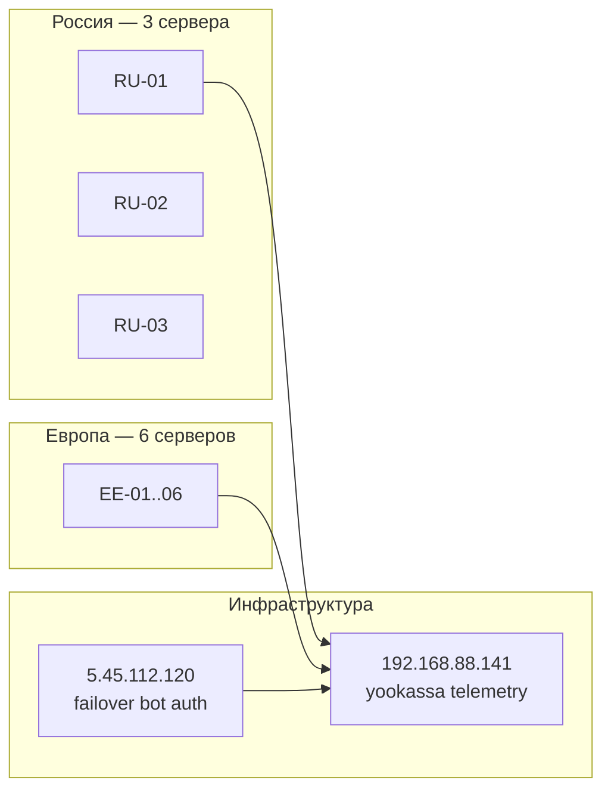
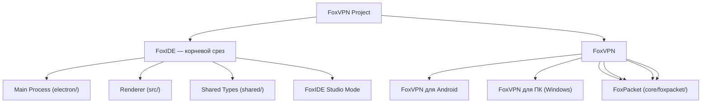

<p align="center">
  
</p>

<br />

# FoxVPN

> **FoxVPN** — кроссплатформенный self-hosted VPN с кастомным протоколом **FoxShake v2**, 18 методами обхода DPI, активной защитой **FoxGuard**, горячей сменой транспорта **FoxSwitch** и нативными клиентами для **Windows** и **Android**.

Документ сгенерирован из интерактивной карты FoxIDE (`99` узлов, `106` связей). Дата: 2026-06-06.

---

## Содержание

1. [Быстрый старт](#быстрый-старт)
2. [Что такое FoxVPN](#что-такое-foxvpn)
3. [Архитектура системы](#архитектура-системы)
4. [Протоколы и транспорты](#протоколы-и-транспорты)
5. [Клиенты: Desktop и Android](#клиенты-desktop-и-android)
6. [Backend и инфраструктура](#backend-и-инфраструктура)
7. [Монетизация и Trial](#монетизация-и-trial)
8. [Сборка и публикация](#сборка-и-публикация)
9. [Как работать с проектом](#как-работать-с-проектом)
10. [Карта проекта (дерево)](#карта-проекта-дерево)
11. [Карта проекта (граф)](#карта-проекта-граф)
12. [Справочник узлов карты](#справочник-узлов-карты)
13. [Ссылки](#ссылки)

---

## Быстрый старт

| Платформа | Скачать | Требования |
|-----------|---------|------------|
| Windows 10/11 | [Последний релиз](https://github.com/itsmyfox/FoxVPN/releases/latest) | x64, интернет |
| Android 7.0+ | `.apk` в релизе | arm64/armv7 |
| Сайт | [itsmyfox.github.io/FoxVPN](https://itsmyfox.github.io/FoxVPN/) | — |

**Первый запуск:**

1. Скачайте клиент и установите.
2. Войдите или активируйте ключ (`fox://`, `vless://`, `hy2://`, `socks5://`).
3. Выберите сервер из списка — цвет бейджа показывает протокол.
4. Нажмите **Подключиться**. Ротатор сам подберёт рабочий протокол для вашего ISP.
5. При блокировке FoxSwitch переключит транспорт без разрыва сессии.

---

## Что такое FoxVPN

FoxVPN — это не просто обёртка над публичным VPN-протоколом. Проект объединяет:

- **Go-ядро** с собственным handshake **FoxShake v2** (Noise_IK, X25519, ChaCha20-Poly1305).
- **Sing-box интеграцию** для VLESS+Reality, Hysteria2, SOCKS5 как fallback.
- **18 методов обхода DPI** (TLS fragmentation, SNI camouflage, DoH tunnel, Reality, Trojan и др.).
- **FoxGuard** — активная защита от зондов DPI и throttle-атак.
- **FoxSwitch** — hot-swap транспорта с буферизацией пакетов в полёте.
- **ISP-тюнинг** — автоопределение провайдера и подстройка MTU/фрагментации.
- **Модульные подписки** через T-Bank + trial 3 дня через Telegram.

### Цветовая схема протоколов (единая для UI)

| Протокол | Цвет | HEX |
|----------|------|-----|
| VLESS | оранжевый | `#FFA07A` |
| Hysteria2 | красный | `#FF6B81` |
| SOCKS5 | синий | `#54A0FF` |
| Fox (FoxShake v2) | зелёный | `#4ADE80` |

---

## Архитектура системы



### Поток подключения пользователя



### Серверная топология



---

## Протоколы и транспорты

### FoxShake v2 (кастомный Fox)

Handshake: **Noise_IK**, X25519 DH, BLAKE2s-256 MAC, HKDF-SHA256, ChaCha20-Poly1305 AEAD.
Анти-DPI: XOR-маски, случайный padding, replay-защита, rekey каждые 60 с / 1 GB.

### Sing-box fallback

Когда все 18 bypass-методов исчерпаны, ядро переключается на sing-box: VLESS+Reality, Hysteria2, SOCKS5.

### Транспортный слой

| Транспорт | Путь | Назначение |
|-----------|------|------------|
| TLS | `transport/tls/` | uTLS fingerprint, ClientHello fragmentation |
| QUIC | `transport/quic/` | UDP, 0-RTT, CID rotation |
| WebSocket | `transport/ws/` | WSS маскировка под браузер |
| RAW | `transport/raw/` | TCP length-prefix, тесты |
| DoH | `transport/doh/` | аварийный DNS TXT tunnel |

### 18 методов bypass (`bypass/`)

Domain Fronting, CDN Worker, Reality, TLS Fragment, SNI Camouflage, ECH, QUIC obfuscation, DNS Tunnel,
Snowflake, H2Mux, NaïveProxy, Trojan, SoftEther, Shadowsocks, Obfs4, ICMP Tunnel, Steganography, ByeDPI.

---

## Клиенты: Desktop и Android

### Windows (Electron 28 + React 18)

| Модуль | Путь | Описание |
|--------|------|----------|
| Main process | `foxapp-desktop/src/main/main.ts` | IPC, proxy, kill-switch, updater |
| FoxGateway | `foxapp-desktop/src/main/fox-gateway.ts` | SOCKS5 gateway, DPI fragmentation |
| UI | `foxapp-desktop/src/renderer/` | Dashboard, серверы, настройки, чат |
| Loader | `foxapp-desktop/bootstrap/` | установка и force-update |

**Возможности Desktop:** TUN/wintun, kill-switch (WFP), system proxy + PAC, overlay, диагностика 4 протоколов,
чат поддержки (WebSocket), Premium-модули, ISP override, SSH-каскады RU→EE.

### Android (Kotlin + Compose)

| Модуль | Путь | Описание |
|--------|------|----------|
| VPN Service | `FoxVpnService.kt` | TUN + VpnService API |
| Manager | `FoxVpnManager.kt` | state, health-check, reconnect |
| UI | `ui/MainScreen.kt` и др. | Compose Material 3 |
| Go bridge | gomobile | FoxMobile API |

**Возможности Android:** FoxDpiSocks5Gateway, HevSocks5Tunnel, version gate, trial banner, support chat,
Premium, admin keys, apps scan reporter.

---

## Backend и инфраструктура

| Сервис | Хост | Порт | Назначение |
|--------|------|------|------------|
| yookassa-server | 192.168.88.141 | 3003 | платежи, ключи, trial, ISP |
| fox-telemetry | 192.168.88.141 | 3002 | телеметрия клиентов |
| ws_chat | 192.168.88.141 | 3005/3006 | чат поддержки real-time |
| failover API | 5.45.112.120 | 3003 | резерв yookassa + `/fox/api` |
| Telegram bot | 5.45.112.120 | — | @givefastvpn_bot |

Ключевые PHP: `shared_keys.php`, `support_chat.php`, `trial.php`.

---

## Монетизация и Trial

| Модуль | Цена | Описание |
|--------|------|----------|
| servers | 199 ₽ (intro 70 ₽) | доступ к серверам |
| keys | 399 ₽ | персональные ключи |
| rotator | 149 ₽ | авто-ротатор протоколов |
| speed | 99 ₽ | приоритет скорости |

**Trial 3 дня:** подписка на канал [@rufoxvpn](https://t.me/rufoxvpn) → код в боте [@givefastvpn_bot](https://t.me/givefastvpn_bot) → redeem в приложении.

---

## Сборка и публикация

```bash
# Полная сборка Desktop + Android + GitHub Release
python build.py

# Деплой лендинга на GitHub Pages
python _deploy_pages.py

# Очистка старых GitHub Pages deployments (оставить 1)
python tools/cleanup_github_pages_deployments.py
```

Артефакты релиза: `FoxVPN.Desktop.*.exe`, `FoxVPN.*.apk`.
Лендинг: `docs/index.html` → ветка `gh-pages`.

---

## Как работать с проектом

### FoxIDE — интерактивная карта

1. Откройте `G:\fox\.foxide\project-map.json` в FoxIDE (Project Map view).
2. Handoff для AI-сессий: `.foxide/map-docs/handoff_FoxVpn.md`.
3. CLI:

```bash
node .foxide/scripts/project-map-cli.mjs summary --root G:\fox
node .foxide/scripts/project-map-cli.mjs read --node-id <uuid> --depth 3
```

### Рекомендуемый порядок изучения кода

1. `core/foxshake/` — протокол.
2. `transport/` — транспорты.
3. `bypass/` + `foxguard/` + `foxswitch/` — обход и защита.
4. `foxapp-desktop/src/main/fox-gateway.ts` — Desktop data plane.
5. `foxapp-android/.../FoxVpnService.kt` — Android tunnel.
6. `yookassa-server/` — backend API.

### Диагностика

- Desktop: Настройки → Диагностика → тест 4 протоколов + TCP/UDP trace.
- Android: аналогичный экран в General Settings (advanced).
- Bot/trial: `python tools/verify_bot_systemd.py`.

---

## Карта проекта (дерево)

Интерактивная карта FoxIDE: **99 узлов**, **106 рёбер**.

- 🌐 **Project**
  - Документация: `J:/fox/foxide/.foxide/map-docs/c02cb962-0c68-49a9-ab9a-d49744123525.md`
  - 🌐 **FoxIDE — корневой срез**
    - FoxIDE — открытый AI-native редактор кода (аналог Cursor/Windsurf) на Electron + React + TypeScript. Поддержка Anthropic, OpenAI, Ollama и любых OpenAI-совместимых провайдеров.
    - Документация: `J:/fox/foxide/.foxide/map-docs/d5ce7c2f-711c-49cd-ac69-f89504ff89b3.md`
    - 📦 **Main Process (electron/)**
      - Electron main-процесс: управление окнами, IPC, AI-агенты, файловая система, SSH, терминал, MCP, индексация, server (A2A/HTTP), Canvas, Project Map, телеметрия. Собирается через tsc -p tsconfig.main.json.
      - Документация: `J:/fox/foxide/.foxide/map-docs/91a2d84f-e98e-4288-baf8-87c64704b286.md`
      - 📦 **AI Subsystem (electron/ai/)**
        - Ядро AI-агента: agent.ts (цикл вызовов LLM/tool), providers.ts (Anthropic/OpenAI/Ollama/OpenAI-compat + Cursor-ротация), tools.ts (определения + исполнение), fallback.ts (цепочка провайдеров), errors.ts, planner.ts (планы/шаги), subagent.ts (делегирование).
        - Документация: `J:/fox/foxide/.foxide/map-docs/4c0134f1-8afd-42a5-a9d7-81f62a2d84c7.md`
        - ⚙️ **Agent Loop (agent.ts)**
          - Центральный цикл runAgent: plan/create_plan/update_plan_step, delegate_to_subagent (параллельно), overflow-strategies (reset/sliding/summary), reconnect-логика (до 9999 попыток), self-reflection при 3+ failed turns, reviewer-pass, auto-decompose nudge, markdown enforcement, context-buffer dumping.
          - Документация: `J:/fox/foxide/.foxide/map-docs/8123f05b-62f5-4e24-8632-1be17e67ee80.md`
        - ⚙️ **Providers (providers.ts)**
          - Клиенты AI-провайдеров: Anthropic (SDK, streaming + thinking), OpenAI-совместимый (streaming, ThinkSplitter для  thinking/ text), Ollama native /api/chat (cloud-модели), Ollama-fallback цепочка (пробинг трёх endpoints), Cursor-ротация (free-first → pro/ultra, cooldown).
          - Документация: `J:/fox/foxide/.foxide/map-docs/d1c8900f-faca-4c03-b29c-41ba697b8d6d.md`
        - ⚙️ **Tools (tools.ts)**
          - Определения + исполнение ~80 инструментов: файловые (read/write/edit/search_replace), файловая система (list_dir/create_dir/delete_path), поиск (grep/glob/codebase_search), shell (run_command + interrupt), memory/scratchpad, plan/create_plan, subagent/delegate/handoff/group_chat, browser (Playwright), remote (SSH), linux (systemd, firewall, пакеты), project-map, canvas, MCP-pass-through, finish.
          - Документация: `J:/fox/foxide/.foxide/map-docs/3d4a5696-017e-498e-9fcf-9eacb1bad3e7.md`
        - ⚙️ **Вспомогательные AI-модули**
          - fallback.ts (цепочка провайдеров), errors.ts (классификация ошибок), planner.ts (планы), subagent.ts/subagent-tester.ts (субагенты + тестирование), routing.ts (профили + round-robin), scratchpad.ts (блокнот), trustworthy.ts (безопасность: meta-prompt, PII, sandbox, инъекции), output-safety.ts (защита вывода), content-guard.ts (анти-инъекции), reflect.ts (самопроверка), density.ts (профили плотности), tool-loadout.ts/tool-retry.ts (RAG-отбор + авто-retry), cost.ts (кеш + router), middleware.ts (middleware-цепочка), otel.ts (OTLP-export), telemetry.ts (spans/traces), audit-export.ts (аудит), indexer.ts (codebase_index), embeddings.ts (эмбеддинги), skills.ts (агентские навыки), report.ts (авто-завершение планов), workflow.ts (workflow-движок), claw.ts (Claw-субагент), groupchat.ts (групповой чат/magnetic/handoff).
          - Документация: `J:/fox/foxide/.foxide/map-docs/d328ebbb-d98e-4b23-a9d9-65ed5be94a4c.md`
        - ⚙️ **Trustworthy AI (trustworthy.ts)**
          - Система безопасности AI: meta-prompt builder (6 блоков), PII-редукция (email/телефоны/IP/карты), anti-injection guard (14 шаблонов), sandbox-команды, детект опасных remote-команд (24 паттерна).
          - Документация: `J:/fox/foxide/.foxide/map-docs/384ce40c-22cf-4b41-bdc9-0a64f41d01b4.md`
        - ⚙️ **Planner Engine (planner.ts)**
          - Plan-and-Execute планировщик: createPlan (авто-сортировка по приоритету error>warning>feature>refactor), updateStep (авто-demote), auto-complete плана, персистентность в userData/plans.json.
          - Документация: `J:/fox/foxide/.foxide/map-docs/ae5bfe91-697c-4ab0-9855-09b9b50bf980.md`
        - ⚙️ **Reflection Engine (reflect.ts)**
          - Self-reflection: после 3+ failed turns подряд агент анализирует свои ошибки и предлагает стратегию исправления (reason + strategyChange + nextAction).
          - Документация: `J:/fox/foxide/.foxide/map-docs/029d06b4-7d16-49b3-ad2f-dec19dc59be8.md`
        - ⚙️ **Routing (routing.ts)**
          - Роутинг делегирования: routeDelegate подбирает provider/model/profile/workerLabel через round-robin по пулу workers, profileAllowedTools определяет whitelist инструментов для каждого профиля.
          - Документация: `J:/fox/foxide/.foxide/map-docs/25f33930-924a-4dcb-b6fa-1cd0a060a1c0.md`
        - 💡 **Skills System**
          - Система навыков: 4 bundled навыка (code-review, test-generator, git-helper, doc-writer), YAML-триггеры, skill-loader из .foxide/skills/, runtime-инжекция в system prompt.
          - Документация: `J:/fox/foxide/.foxide/map-docs/b14136ef-b405-47ae-8810-371c7cfb904b.md`
        - 📦 **Workflow Engine / DAG Runtime**
          - electron/ai/workflow.ts — DAG-движок для агентных задач. EdgeType: direct/conditional/switch/fanOut/fanIn. Checkpoint и resume состояний.
          - Документация: `J:/fox/foxide/.foxide/map-docs/ab110000-0005-4000-8000-000000000005.md`
        - 📦 **Group Chat, Handoff & Magnetic Manager**
          - electron/ai/groupchat.ts — три паттерна многоагентной работы. GroupParticipant (worker/reviewer/researcher), Handoff между агентами, Magnetic Manager с динамическим планом.
          - Документация: `J:/fox/foxide/.foxide/map-docs/ab110000-0006-4000-8000-000000000006.md`
        - 📦 **Embeddings & Code Indexer / RAG**
          - electron/ai/embeddings.ts — семантическое индексирование кода. Чанкинг по функциям/классам, cosine similarity поиск, инкрементальное обновление. top-K RAG для контекста.
          - Документация: `J:/fox/foxide/.foxide/map-docs/ab110000-0007-4000-8000-000000000007.md`
        - 📦 **Response Cache & Router Model**
          - electron/ai/cost.ts — LRU in-memory + JSONL disk кэш. SHA-256 хэш по provider+model+messages+tools+temp. Router-модель: тривиальные → дешёвая модель.
          - Документация: `J:/fox/foxide/.foxide/map-docs/ab110000-0008-4000-8000-000000000008.md`
        - 📦 **Telemetry, Traces & OpenTelemetry**
          - electron/ai/telemetry.ts — OpenTelemetry трейсинг AI вызовов. Spans: agent.run/step, ai.completion, tool.execute, memory.search. Атрибуты: tokens, cost, latency, cached.
          - Документация: `J:/fox/foxide/.foxide/map-docs/ab110000-0009-4000-8000-000000000009.md`
        - 📦 **Tool Loadout RAG & Middleware Chain**
          - tools.ts (~2154 строки, 60+ инструментов). Semantic RAG выбирает top-15 релевантных. Middleware: auth → cache → rateLimit → telemetry → retry → logging.
          - Документация: `J:/fox/foxide/.foxide/map-docs/ab110000-0010-4000-8000-000000000010.md`
        - 📦 **Agent Report & Content Security**
          - Генерация структурированных отчётов агента (steps, toolCalls, artifacts, tokens, cost, traces). Content Security: PII scrubber, secret detector, prompt injection filter.
          - Документация: `J:/fox/foxide/.foxide/map-docs/ab110000-0011-4000-8000-000000000011.md`
      - 📦 **IPC Handlers (electron/ipc/)**
        - IPC-обработчики: agent, fs, shell, settings, ssh, terminal, approval, conversations, pending-edits, mcp, telemetry, memory, planner, cost, feedback, background, eval, server, workflow, cursor, logger, canvas, skills, subagents, project-map.
        - Документация: `J:/fox/foxide/.foxide/map-docs/d0efe679-59bc-4ae7-8b45-c87531f83336.md`
      - 📦 **MCP (electron/mcp/)**
        - MCP-клиент (Model Context Protocol): подключение к внешним MCP-серверам (stdio/http), пул серверов, вызовы инструментов/ресурсов/промптов, авто-синхронизация при старте.
        - Документация: `J:/fox/foxide/.foxide/map-docs/977eb244-c2dd-4cc1-bea4-a2b249824c0f.md`
      - 📦 **Memory (electron/memory/)**
        - Долговременная память: store.ts (persona/episodic/entity-graph), retriever.ts (гибридный retrieval), knowledge-agent.ts (авто-извлечение знаний), code-index.ts (структурный RAG-индекс кода).
        - Документация: `J:/fox/foxide/.foxide/map-docs/c7dc65e9-6396-4479-8e9b-0bbba82d1e9c.md`
      - 📦 **SSH (electron/ssh/)**
        - SSH-клиент (ssh2): подключение, SFTP, shell, exec, bridge-агент на удалённой машине, проброс файловых операций, remote_* + linux_* инструменты для удалённого управления Linux-машинами.
        - Документация: `J:/fox/foxide/.foxide/map-docs/77684401-8385-448c-a6be-5d6a7358d2f6.md`
      - 📦 **Server (electron/server/)**
        - HTTP/A2A сервер: Agent-to-Agent JSON-RPC (E15), NLWeb natural-language query endpoint (E16), outgoing A2A-вызовы (E28), nlweb-index для индексации внешних источников.
        - Документация: `J:/fox/foxide/.foxide/map-docs/29e49823-dbfd-4d78-abda-aa2407650905.md`
      - 📦 **Canvas Compiler (electron/canvas/)**
        - Canvas-компиляция: compile.ts — компилирует .canvas.tsx файлы через esbuild в JS-бандл, выполняется в main-процессе, результат отдаётся рендереру для iframe-песочницы.
        - Документация: `J:/fox/foxide/.foxide/map-docs/cdb483df-5737-4996-8f1a-bd6ff2c4d42e.md`
      - 📦 **Project Map (electron/project-map/)**
        - Project Map: store.ts — сохранение/загрузка графа знаний проекта (узлы + рёбра) в JSON, markdown-документация узлов, viewport. Map-инструменты доступны агенту: read/add/update/remove.
        - Документация: `J:/fox/foxide/.foxide/map-docs/8b1352bd-c675-4729-b4b3-97de584f817f.md`
      - 📦 **Browser (electron/browser/)**
        - Встроенный headless-браузер на базе Playwright: открытие страниц, скриншоты, извлечение текста/структурированных данных, клики, ввод, JavaScript. 9 инструментов агента.
        - Документация: `J:/fox/foxide/.foxide/map-docs/067e66f8-fe85-4e56-8d23-d976682526a8.md`
      - 📦 **Background Diagnostics (electron/background/)**
        - Фоновый tsc/eslint-диагностик: chokidar-наблюдение за файлами, debounce-сканирование, авто-детект ошибок компиляции, баннер в чате, авто-предложение исправлений.
        - Документация: `J:/fox/foxide/.foxide/map-docs/772bfdd9-7bbd-4f01-95e1-dd4aee7dba06.md`
      - 📦 **Eval Runner (electron/eval/)**
        - Eval-раннер для тестовых кейсов: изолированный запуск агента на наборе задач, замер метрик (прохождение/время/токены), авто-сидирование дефолтных кейсов, прогресс-события.
        - Документация: `J:/fox/foxide/.foxide/map-docs/564f7a12-06fd-4720-83f9-78aa8e8cf663.md`
      - 📦 **Feedback Store (electron/feedback/)**
        - Обратная связь пользователя: up/down vote на сообщения агента, retry-метрики (похожесть + время), статистика approval rate и retry rate.
        - Документация: `J:/fox/foxide/.foxide/map-docs/d35ebecf-63a0-4c58-a9cb-8455d32b450d.md`
      - 📦 **Utils / Logger (electron/utils/)**
        - Утилиты логирования: структурированный логгер ошибок/предупреждений в foxide-errors.log + errors.jsonl, обёртка для безопасного吞咽ления исключений.
        - Документация: `J:/fox/foxide/.foxide/map-docs/bbdf609e-ca13-482c-86e6-a25efbe5a93e.md`
      - 📦 **Browser (Playwright)**
        - Playwright-браузер: запуск Chromium через CDP, 9 инструментов (navigate/click/type/screenshot/extract/scroll/evaluate/wait/snapshot), авто-восстановление при крахе, sandbox-изоляция.
        - Документация: `J:/fox/foxide/.foxide/map-docs/4248bc0b-27b5-4528-9183-95a644354ad2.md`
      - 📦 **Background Diagnostics**
        - Фоновая диагностика: tsc-проверки (debounce 5s), ESLint-прогоны, авто-исправление импортов, health-check провайдеров, мониторинг памяти, фоновый git status.
        - Документация: `J:/fox/foxide/.foxide/map-docs/f5f8406f-4e0b-4b3c-ae92-1d0410be5aee.md`
      - 📦 **Eval Runner**
        - Eval-раннер: прогон тестов через Jest/Mocha/Vitest, бенчмарки, метрики качества кода, comparison-режим (A/B diff).
        - Документация: `J:/fox/foxide/.foxide/map-docs/4caf223e-a1f8-4d5a-8cd8-c11338777b07.md`
      - 📦 **Feedback Store**
        - Сбор обратной связи: up/down votes на AI-ответы, retry-rate персистентность, aggregated-метрики для улучшения routing.
        - Документация: `J:/fox/foxide/.foxide/map-docs/a678d1a2-1616-45fc-9ccc-ab7c999848c8.md`
      - 📦 **Logger**
        - Логгер ошибок: errors.log + errors.jsonl, structured-error capture (стектрейс + контекст + conversationId), авто-ротация при >10MB, dedup-группировка одинаковых ошибок.
        - Документация: `J:/fox/foxide/.foxide/map-docs/0f1bbe75-30ca-4569-be36-f96f249581f2.md`
    - 📦 **Renderer (src/)**
      - Vite + React + TypeScript рендерер. Monaco Editor, Zustand-стейты (chat/settings/workspace), Canvas SDK, UI-компоненты. Собирается через vite build → dist/renderer.
      - Документация: `J:/fox/foxide/.foxide/map-docs/08aa4969-5065-4712-9614-f5bc835d5336.md`
      - 📦 **UI-компоненты**
        - React-компоненты: FileTree (проводник), EditorPane (Monaco), Chat (общение с агентом), Settings (настройки), StatusBar, WelcomePage, SshPanel, LocalTerminal, SearchPanel, ApprovalModal, CanvasPanel, ProjectMapView, PlanPanel, AgentGraph (визуализация агента), TracesPanel (трассировка), InlineEdit, MarkdownEditor, Icon.
        - Документация: `J:/fox/foxide/.foxide/map-docs/e331e5b8-afe5-451b-91c8-7f8734ca4fe3.md`
        - ⚙️ **Chat Component (Chat.tsx)**
          - Главный компонент чата: streaming-сообщения агента, reasoning-блоки, tool calls/results с диффами, plan panel, cost plate, отмена/пауза, attachments, переключение провайдера/модели/режима.
          - Документация: `J:/fox/foxide/.foxide/map-docs/141a801c-e290-466f-80e9-3515b5621f70.md`
        - ⚙️ **EditorPane (EditorPane.tsx)**
          - Monaco Editor с мульти-табами: AI-диффы (зелёные/красные линии), dirty-маркеры, контекстное меню, подсветка синтаксиса для всех языков, инлайн-принятие/отмена AI-правок.
          - Документация: `J:/fox/foxide/.foxide/map-docs/4c057f7c-2636-4ac7-9ce8-089f6fd9cef3.md`
      - ⚙️ **Состояние (Zustand stores)**
        - Три Zustand-стейта: chat.ts (сообщения, conversation, отправка/отмена, pending-сообщения, diff-хранение), settings.ts (загрузка/сохранение настроек), workspace.ts (файлы, редактор, AI-правки, dirty-флаги, remote-сессия).
        - Документация: `J:/fox/foxide/.foxide/map-docs/788d8444-ad5e-4b5f-a03c-064f1a473ff9.md`
        - ⚙️ **Chat Store (chat.ts)**
          - Zustand-стейт чата: диалоги, сообщения, streaming, pending-сообщения, AI-диффы, планы агента, usage-статистика, отправка/отмена/пауза.
          - Документация: `J:/fox/foxide/.foxide/map-docs/f01ba8fe-fab5-4e87-8f72-d970a8c89770.md`
        - ⚙️ **Settings Store (settings.ts)**
          - Zustand-стейт настроек: загрузка/сохранение AppSettings, авто-детект локальных провайдеров, миграция legacy-настроек, CursorConfig.
          - Документация: `J:/fox/foxide/.foxide/map-docs/dde5a7c8-8d8a-4d26-9249-5d1ed342f2d0.md`
        - ⚙️ **Workspace Store (workspace.ts)**
          - Zustand-стейт workspace: файлы/папки, открытые редакторы, Monaco-модели, dirty-флаги, AI-правки (зелёные/красные линии), remote SSH-сессия, сохранение.
          - Документация: `J:/fox/foxide/.foxide/map-docs/46a7f798-0269-47c3-a64c-2f621dc05aab.md`
      - 📦 **Canvas SDK (src/canvas-sdk/)**
        - Песочница для Canvas-артефактов: iframeShell.ts (безопасный iframe-хост), index.tsx (регистрация "cursor/canvas" — примитивы Stack/Row/Grid/Card/Table/Chart/Callout).
        - Документация: `J:/fox/foxide/.foxide/map-docs/e6ef6761-1fab-4196-8b00-8ef109fc68c5.md`
    - 📦 **Shared Types (shared/)**
      - Общие типы и константы для main ↔ renderer IPC: AppSettings, ChatMessage, AgentEvent, ToolCall, PlanStep, конфигурации провайдеров/SSH/MCP/памяти/Canvas/браузера/A2A. Ценообразование (pricing.ts) и профили плотности (density.ts).
      - Документация: `J:/fox/foxide/.foxide/map-docs/7d1188a8-4c4c-4bc3-84f9-3d8fc3671321.md`
    - 📦 **FoxIDE Studio Mode**
      - Видео/фото-генерация через Nano Banana 2 + Dreamina (Seedance 2.0) + ElevenLabs (TTS/SFX/Voice Design) + ffmpeg. 5 режимов: Фото, Видео, Раскадровка фото, Раскадровка видео, Студия. Один tool media_studio_run превращает идею в озвученный mp4. Sprint 1+2+3 завершены: 13 media-tools, все системные prompts и параметры микса/голоса/субтитров вынесены в Settings и редактируемы. Auto-pickup ``08-audio/music.mp3``.
      - Документация: `.foxide/map-docs/handoff_FoxIDE.md`
  - 📦 **FoxVPN**
    - FoxVPN — кроссплатформенный VPN с кастомным протоколом FoxShake v2, 18 методами обхода DPI, контр-атаками и камуфляжем трафика.
    - Документация: `J:/fox/foxide/.foxide/map-docs/668ee47d-e861-4beb-920c-a5c815c7f6c2.md`
    - 📦 **FoxVPN для Android**
      - FoxVPN для Android: Kotlin/Compose, VpnService API, gomobile-ядро Fox. Сборка через Gradle, minSdk=24, targetSdk=34.
      - Документация: `J:/fox/foxide/.foxide/map-docs/deab4fb6-1bd9-4889-9fe6-2e778eae2f98.md`
      - ⚙️ **Android: VPN-туннель и управление состоянием**
        - FoxVpnService (TUN + VpnService API) + FoxVpnManager (управление состоянием, health-check, socks-аутентификация).
        - Документация: `J:/fox/foxide/.foxide/map-docs/10f258a5-d0fe-4ca6-993f-f4392e41433c.md`
        - ⚙️ **Android: ISP per-provider тюнинг**
          - Автоопределение ISP и применение оптимальных VPN-настроек, синхронизация с бэкендом.
          - Документация: `J:/fox/foxide/.foxide/map-docs/andr0001-0001-4000-8000-000000000001.md`
        - ⚙️ **Android: Диагностика**
          - Диагностика VPN-соединений: тест 4 протоколов, TCP/UDP-трассировка, автоотправка отчётов.
          - Документация: `J:/fox/foxide/.foxide/map-docs/andr0001-0002-4000-8000-000000000002.md`
        - ⚙️ **Android: i18n — Локализация**
          - Кастомная система локализации: RU/EN, runtime-переключение, JSON-словари.
          - Документация: `J:/fox/foxide/.foxide/map-docs/andr0001-0003-4000-8000-000000000003.md`
        - ⚙️ **Android: Premium-экосистема**
          - Модульные подписки, оффлайн-кеш, админ-панель ключей, T-Bank интеграция.
          - Документация: `J:/fox/foxide/.foxide/map-docs/andr0001-0004-4000-8000-000000000004.md`
        - ⚙️ **Android: Version Gate**
          - Серверная проверка версии, принудительное обновление, блокировка устаревших клиентов.
          - Документация: `J:/fox/foxide/.foxide/map-docs/andr0001-0005-4000-8000-000000000005.md`
      - 📦 **Android: UI-слой (Compose)**
        - Jetpack Compose UI: Dashboard, Servers, Settings, Logs, Diagnostics. Анимации, Material 3, StateFlow. Цвета протоколов: VLESS=#FFA07A, HY2=#FF6B81, SOCKS5=#54A0FF, Fox=#4ADE80.
        - Документация: `J:/fox/foxide/.foxide/map-docs/6b8a2e40-9a32-4317-a167-130aaf668df6.md`
        - ⚙️ **Цветовая схема протоколов (UI)**
          - VLESS=#FFA07A, Hysteria2=#FF6B81, SOCKS5=#54A0FF, Fox=#4ADE80
          - Документация: `J:/fox/foxide/.foxide/map-docs/cc010000-0001-4000-8000-000000000001.md`
      - ⚙️ **Android: обход DPI и антидетект**
        - FoxDpiSocks5Gateway, фрагментация ClientHello, антидетект-домены, CidrSet, DNS-snooping, VpnService.protect().
        - Документация: `J:/fox/foxide/.foxide/map-docs/757c27ae-edfc-4990-8bcc-5b4e92bb37d1.md`
      - 📦 **Android: Auth, Data, API**
        - AuthManager (JWT+EncryptedPrefs), модели Server/PersonalKey/AppSettings, API-клиенты, AppsScanReporter.
        - Документация: `J:/fox/foxide/.foxide/map-docs/35b8c975-b24e-47a3-9f0c-c4819ab4c2d2.md`
      - ⚙️ **Android: интеграция с Go-ядром**
        - FoxMobile API (Go через gomobile), XrayCoreProxy, HevSocks5Tunnel (UDP через SOCKS5), JNI-библиотеки arm64/armv7.
        - Документация: `J:/fox/foxide/.foxide/map-docs/272ea16b-d56e-4cbc-a09f-1cfb0f33a9a5.md`
      - ⚙️ **Fox Stabilizer (Fixnet-аналог)**
        - Режим при VPN connect: zapret-style DPI для Discord/YouTube/Telegram. ПК: stabilizer/*. Android: stabilizer/*. Опционально winws sidecar.
        - Документация: `g:/fox/.foxide/map-docs/fox-stabilizer-001.md`
    - 📦 **FoxVPN для ПК (Windows)**
      - FoxVPN для ПК (Windows): Electron 28 + React 18 + TypeScript, TUN-адаптер (wintun/tun2socks), FoxGateway, kill-switch, SSH-туннелирование.
      - Документация: `J:/fox/foxide/.foxide/map-docs/80ee4d75-06b5-4a17-a211-2a544db2a8a5.md`
      - ⚙️ **ПК: TUN, маршрутизация и Kill-Switch**
        - TUN-адаптер (wintun/tun2socks), 14-шаговая маршрутизация, Kill-Switch (5 правил WFP), Strict TUN, IPv6 Leak Protection.
        - Документация: `J:/fox/foxide/.foxide/map-docs/b3cf1ff0-7d66-42bf-9127-5bd0dade01f3.md`
      - ⚙️ **ПК: FoxGateway и умная маршрутизация**
        - FoxGateway (4000+ строк Node.js SOCKS5), умная маршрутизация, DPI-фрагментация, антидетект, DNS-snooping, UDP relay, anti-probe.
        - Документация: `J:/fox/foxide/.foxide/map-docs/54e9a9ae-804a-4ecb-a6b2-246d768e0846.md`
        - ⚙️ **ПК: ISP per-provider тюнинг**
          - Автоопределение ISP на Windows, 16 файлов ISP-модуля, синхронизация с бэкендом.
          - Документация: `J:/fox/foxide/.foxide/map-docs/desk0001-0001-4000-8000-000000000001.md`
        - ⚙️ **ПК: Диагностика**
          - Диагностика VPN: 8 файлов, тесты подключений, трассировка, отчёты.
          - Документация: `J:/fox/foxide/.foxide/map-docs/desk0001-0002-4000-8000-000000000002.md`
        - ⚙️ **ПК: Premium и Zustand-стейты**
          - Premium-подписки, Zustand-стейты, интеграция с магазинами.
          - Документация: `J:/fox/foxide/.foxide/map-docs/desk0001-0003-4000-8000-000000000003.md`
      - 📦 **ПК: UI-слой (React)**
        - React-рендерер (Dashboard, Servers, Settings, Logs, Diagnostics), Zustand-стейты, 100+ IPC-каналов, i18n. Цвета протоколов: VLESS=#FFA07A, HY2=#FF6B81, SOCKS5=#54A0FF, Fox=#4ADE80.
        - Документация: `J:/fox/foxide/.foxide/map-docs/c1e68f85-3064-407b-bf42-1846f2dabfac.md`
        - ⚙️ **Цветовая схема протоколов (UI)**
          - VLESS=#FFA07A, Hysteria2=#FF6B81, SOCKS5=#54A0FF, Fox=#4ADE80
          - Документация: `J:/fox/foxide/.foxide/map-docs/cc010000-0001-4000-8000-000000000001.md`
      - ⚙️ **ПК: управление Go-ядром и протоколами**
        - Запуск Go-ядра, transport-приоритет, auto-reconnect/fallback, system proxy, управление процессами, логгер.
        - Документация: `J:/fox/foxide/.foxide/map-docs/5f72fe62-8805-4570-a8b2-b7dcf0b8bfc0.md`
      - ⚙️ **ПК: SSH, каскады, ISP и диагностика**
        - SSH-настройка серверов, каскадное подключение RU→EE, ISP-детектор, диагностика 4 протоколов.
        - Документация: `J:/fox/foxide/.foxide/map-docs/185ccede-ea91-48c8-8236-be8313084c4b.md`
      - ⚙️ **Fox Stabilizer (Fixnet-аналог)**
        - Режим при VPN connect: zapret-style DPI для Discord/YouTube/Telegram. ПК: stabilizer/*. Android: stabilizer/*. Опционально winws sidecar.
        - Документация: `g:/fox/.foxide/map-docs/fox-stabilizer-001.md`
    - 📦 **Go-ядро FoxVPN (cmd/ + foxapp/)**
      - CLI-инструменты (cmd/), веб-UI клиент (foxapp/main.go), мобильный API (foxmobile/). Точка сборки всего VPN-движка.
      - Документация: `J:/fox/foxide/.foxide/map-docs/fa110000-0001-4000-8000-000000000001.md`
    - 🔐 **Протокол FoxShake v2 (core/foxshake/)**
      - Noise_IK handshake: X25519 DH, BLAKE2s-256 MAC, HKDF-SHA256 KDF, ChaCha20-Poly1305 AEAD. Анти-DPI: XOR-маски, случайный паддинг, replay-защита.
      - Документация: `J:/fox/foxide/.foxide/map-docs/fa110000-0002-4000-8000-000000000002.md`
      - 📦 **FoxCrypto (core/foxcrypto/)**
        - ChaCha20-Poly1305 шифрование, HKDF-SHA256 деривация ключей, ReplayFilter (sliding window), RekeyScheduler (60s/1GB лимиты).
        - Документация: `J:/fox/foxide/.foxide/map-docs/fa110000-0003-4000-8000-000000000003.md`
    - 📦 **FoxCrypto (core/foxcrypto/)**
      - ChaCha20-Poly1305 шифрование, HKDF-SHA256 деривация ключей, ReplayFilter (sliding window), RekeyScheduler (60s/1GB лимиты).
      - Документация: `J:/fox/foxide/.foxide/map-docs/fa110000-0003-4000-8000-000000000003.md`
    - 📦 **FoxPacket (core/foxpacket/)**
      - Кастомный wire-формат: случайный паддинг, AEAD-защита заголовка как AAD, 9 флагов (Data/Chaff/UDP/Fragment...), фрагментация, UDP-инкапсуляция.
      - Документация: `J:/fox/foxide/.foxide/map-docs/fa110000-0004-4000-8000-000000000004.md`
      - 📦 **FoxCrypto (core/foxcrypto/)**
        - ChaCha20-Poly1305 шифрование, HKDF-SHA256 деривация ключей, ReplayFilter (sliding window), RekeyScheduler (60s/1GB лимиты).
        - Документация: `J:/fox/foxide/.foxide/map-docs/fa110000-0003-4000-8000-000000000003.md`
    - 📦 **Транспортный уровень (transport/)**
      - Абстрактный интерфейс Transport с 5 реализациями. ProbeResult для измерения задержки. Dial/Listen/Probe API.
      - Документация: `J:/fox/foxide/.foxide/map-docs/fa110000-0006-4000-8000-000000000006.md`
      - 📦 **TLS-транспорт (transport/tls/)**
        - uTLS fingerprinting (Chrome/FF/Safari/Edge, взвешенная рандомизация), DPI-фрагментация ClientHello (fragConn), HTTP/2 мультиплексирование, session cache.
        - Документация: `J:/fox/foxide/.foxide/map-docs/fa110000-0007-4000-8000-000000000007.md`
      - 📦 **QUIC-транспорт (transport/quic/)**
        - UDP-based транспорт с TLS 1.3. Connection ID rotation, паддинг до MTU, 0-RTT, мультиплексирование потоков. Устойчив к packet loss.
        - Документация: `J:/fox/foxide/.foxide/map-docs/fa110000-0008-4000-8000-000000000008.md`
      - 📦 **WebSocket-транспорт (transport/ws/)**
        - WSS/WS транспорт через gorilla/websocket. Маскировка под браузерный трафик. HTTP upgrade, binary frames, ping/pong keepalive.
        - Документация: `J:/fox/foxide/.foxide/map-docs/fa110000-0009-4000-8000-000000000009.md`
      - 📦 **RAW-транспорт (transport/raw/)**
        - Простейший TCP + 4B length-prefix фрейминг. Fake-preamble для имитации SSH/HTTP. Только для тестирования / внутренних сетей.
        - Документация: `J:/fox/foxide/.foxide/map-docs/fa110000-0010-4000-8000-000000000010.md`
      - 📦 **DNS-over-HTTPS (transport/doh/)**
        - Аварийный канал: туннелирование данных через DNS TXT записи поверх HTTPS. Base64url кодирование, 150ms polling. Fallback при тотальных блокировках.
        - Документация: `J:/fox/foxide/.foxide/map-docs/fa110000-0011-4000-8000-000000000011.md`
    - 📦 **FoxGuard (foxguard/)**
      - Активная защита от DDoS/Throttle/Probe атак. 4 режима (Passive/Reflect/Adaptive/Scatter). Amplifier генерирует junk обратно в атакующего.
      - Документация: `J:/fox/foxide/.foxide/map-docs/fa110000-0012-4000-8000-000000000012.md`
    - 📦 **FoxSwitch (foxswitch/)**
      - Автопереключение транспортов без потери пакетов. HandoverManager буферизует 256 пакетов в полёте. probeLoop каждые 30с мониторит качество.
      - Документация: `J:/fox/foxide/.foxide/map-docs/fa110000-0013-4000-8000-000000000013.md`
      - 📦 **Транспортный уровень (transport/)**
        - Абстрактный интерфейс Transport с 5 реализациями. ProbeResult для измерения задержки. Dial/Listen/Probe API.
        - Документация: `J:/fox/foxide/.foxide/map-docs/fa110000-0006-4000-8000-000000000006.md`
        - 📦 **TLS-транспорт (transport/tls/)**
          - uTLS fingerprinting (Chrome/FF/Safari/Edge, взвешенная рандомизация), DPI-фрагментация ClientHello (fragConn), HTTP/2 мультиплексирование, session cache.
          - Документация: `J:/fox/foxide/.foxide/map-docs/fa110000-0007-4000-8000-000000000007.md`
        - 📦 **QUIC-транспорт (transport/quic/)**
          - UDP-based транспорт с TLS 1.3. Connection ID rotation, паддинг до MTU, 0-RTT, мультиплексирование потоков. Устойчив к packet loss.
          - Документация: `J:/fox/foxide/.foxide/map-docs/fa110000-0008-4000-8000-000000000008.md`
        - 📦 **WebSocket-транспорт (transport/ws/)**
          - WSS/WS транспорт через gorilla/websocket. Маскировка под браузерный трафик. HTTP upgrade, binary frames, ping/pong keepalive.
          - Документация: `J:/fox/foxide/.foxide/map-docs/fa110000-0009-4000-8000-000000000009.md`
        - 📦 **RAW-транспорт (transport/raw/)**
          - Простейший TCP + 4B length-prefix фрейминг. Fake-preamble для имитации SSH/HTTP. Только для тестирования / внутренних сетей.
          - Документация: `J:/fox/foxide/.foxide/map-docs/fa110000-0010-4000-8000-000000000010.md`
        - 📦 **DNS-over-HTTPS (transport/doh/)**
          - Аварийный канал: туннелирование данных через DNS TXT записи поверх HTTPS. Base64url кодирование, 150ms polling. Fallback при тотальных блокировках.
          - Документация: `J:/fox/foxide/.foxide/map-docs/fa110000-0011-4000-8000-000000000011.md`
    - 📦 **Traffic Shaping (shaping/)**
      - Маскировка паттернов VPN-трафика. ChaffGenerator (фоновый мусорный трафик), LogNormal/Gaussian Jitter (имитация браузерных задержек), padder.
      - Документация: `J:/fox/foxide/.foxide/map-docs/fa110000-0014-4000-8000-000000000014.md`
    - 📦 **Обход DPI (bypass/)**
      - 18 методов обхода DPI: Domain Fronting, CDN Worker, Reality, TLS Fragment, SNI Camouflage, ECH, QUIC, DNS Tunnel, Snowflake, H2Mux, NaïveProxy, Trojan, SoftEther, Shadowsocks, Obfs4, ICMP Tunnel, Steganography, ByeDPI.
      - Документация: `J:/fox/foxide/.foxide/map-docs/fa110000-0015-4000-8000-000000000015.md`
      - 📦 **Транспортный уровень (transport/)**
        - Абстрактный интерфейс Transport с 5 реализациями. ProbeResult для измерения задержки. Dial/Listen/Probe API.
        - Документация: `J:/fox/foxide/.foxide/map-docs/fa110000-0006-4000-8000-000000000006.md`
        - 📦 **TLS-транспорт (transport/tls/)**
          - uTLS fingerprinting (Chrome/FF/Safari/Edge, взвешенная рандомизация), DPI-фрагментация ClientHello (fragConn), HTTP/2 мультиплексирование, session cache.
          - Документация: `J:/fox/foxide/.foxide/map-docs/fa110000-0007-4000-8000-000000000007.md`
        - 📦 **QUIC-транспорт (transport/quic/)**
          - UDP-based транспорт с TLS 1.3. Connection ID rotation, паддинг до MTU, 0-RTT, мультиплексирование потоков. Устойчив к packet loss.
          - Документация: `J:/fox/foxide/.foxide/map-docs/fa110000-0008-4000-8000-000000000008.md`
        - 📦 **WebSocket-транспорт (transport/ws/)**
          - WSS/WS транспорт через gorilla/websocket. Маскировка под браузерный трафик. HTTP upgrade, binary frames, ping/pong keepalive.
          - Документация: `J:/fox/foxide/.foxide/map-docs/fa110000-0009-4000-8000-000000000009.md`
        - 📦 **RAW-транспорт (transport/raw/)**
          - Простейший TCP + 4B length-prefix фрейминг. Fake-preamble для имитации SSH/HTTP. Только для тестирования / внутренних сетей.
          - Документация: `J:/fox/foxide/.foxide/map-docs/fa110000-0010-4000-8000-000000000010.md`
        - 📦 **DNS-over-HTTPS (transport/doh/)**
          - Аварийный канал: туннелирование данных через DNS TXT записи поверх HTTPS. Base64url кодирование, 150ms polling. Fallback при тотальных блокировках.
          - Документация: `J:/fox/foxide/.foxide/map-docs/fa110000-0011-4000-8000-000000000011.md`
    - 📦 **Singbox Integration (singbox/)**
      - Интеграция с sing-box: VMess, VLESS+Reality, Trojan, Shadowsocks, Hysteria2, TUIC. Используется как fallback когда все 18 bypass методов не помогают.
      - Документация: `J:/fox/foxide/.foxide/map-docs/fa110000-0016-4000-8000-000000000016.md`
    - 📦 **FoxVPN для iOS (foxvpn-ios/)**
      - React Native приложение. FoxMobile.xcframework (gomobile), iOS NetworkExtension (PacketTunnelProvider). useVpnStore, useAuthStore, Premium, Rotator, MultiVpn.
      - Документация: `J:/fox/foxide/.foxide/map-docs/fa110000-0017-4000-8000-000000000017.md`
    - 📦 **Antidetect (antidetect/)**
      - Маскировка VPN от систем детекции. AntidetectDomains → DNS → CIDR bypass. CidrSet для прямой маршрутизации к госсервисам РФ (Госуслуги, банки).
      - Документация: `J:/fox/foxide/.foxide/map-docs/ab110000-0001-4000-8000-000000000001.md`
    - 📦 **Config & ShareLinks (config/)**
      - ServerConfig/ClientConfig/FoxUser/ExitServer структуры. fox:// URI формат: ParseFoxLink (XOR маскировка + VMProtect mutation). ToClientConfig(), ToSocks5Link().
      - Документация: `J:/fox/foxide/.foxide/map-docs/ab110000-0002-4000-8000-000000000002.md`
    - 📦 **VMProtect — Защита кода (vmp/)**
      - CGO интеграция VMProtect SDK. Anti-debug, anti-VM, CRC integrity, строковая обфускация. Windows/Android: реальный SDK. Остальное: no-op stub.
      - Документация: `J:/fox/foxide/.foxide/map-docs/ab110000-0003-4000-8000-000000000003.md`
    - 📦 **Rate Limiter (ratelimit/)**
      - Token Bucket алгоритм для ограничения пропускной способности в Mbps. Limiter, LimitedWriter, LimitedReader. Thread-safe через sync.Mutex.
      - Документация: `J:/fox/foxide/.foxide/map-docs/ab110000-0004-4000-8000-000000000004.md`
    - 💡 **Handoff: FoxVPN**
      - Handoff-документ FoxVPN: цель, состояние (95 узлов), файлы, изменения (8 сессий: сортировка, цвета, FoxIDE, лендинг, updater, чат поддержки, оверлей, системный прокси). Обновлять при каждой сессии.
      - Документация: `.foxide/map-docs/handoff_FoxVpn.md`
    - 📦 **FoxVPN Backend Hub (192.168.88.141)**
      - Центральный backend-сервер: платежи, телеметрия, ISP-профили, управление ключами. Ubuntu 22.04, 8GB RAM, диск 97%.
      - Документация: `J:/fox/foxide/.foxide/map-docs/srv00001-0001-4000-8000-000000000001.md`
    - 📦 **fox-telemetry (Node.js :3002)**
      - Сервис приёма телеметрии VPN-клиентов. Node.js, порт 3002.
      - Документация: `J:/fox/foxide/.foxide/map-docs/srv00001-0002-4000-8000-000000000002.md`
    - 📦 **yookassa-server (PHP :3003)**
      - Платежи T-Bank, подписки, ключи, ISP-профили. PHP-FPM 9 workers, порт 3003.
      - Документация: `J:/fox/foxide/.foxide/map-docs/srv00001-0003-4000-8000-000000000003.md`
    - 📦 **cursor-rotator (Node.js :8765)**
      - Ротация Cursor AI аккаунтов. Node.js, порт 8765.
      - Документация: `J:/fox/foxide/.foxide/map-docs/srv00001-0004-4000-8000-000000000004.md`
    - ⚙️ **Системный прокси (Win Settings UI)**
      - Корректное отображение прокси FoxVPN в ms-settings:network-proxy на Win10/11. Dispatch ручной/PAC по тумблеру usePacFile в Правилах. Modern Settings UI читает бинарный блоб DefaultConnectionSettings, а не loose-ключи — пишем блоб байт-в-байт (writeConnectionBlob) с инкрементируемым counter. IPv6-токены с :: в ProxyOverride ломают парсер Settings UI → фильтруются в buildBypassFromRules. Сессия #8 (2026-05-23).
    - 📦 **MikroTik hAP ac³ (192.168.88.1) ⚠ Wi-Fi OK / VPN paused**
      - Wi-Fi-инфра (этап 5) ВЫПОЛНЕНА 2026-05-24: усилены wlan1→20 dBm и wlan2→23 dBm (регуляторный max RU); созданы 2 virtual AP — ENET_WIFI_2.4Ghz (Bridge-VPN-EE2 192.168.10.0/24) и ENET_WIFI_5.0Ghz (Bridge-VPN-EE4 192.168.20.0/24); DHCP, mangle PBR (disabled), routing tables vpn-ee2-wifi/vpn-ee4-wifi (routes disabled). VLESS-контейнеры (xray-ee2/ee4) ВРЕМЕННО удалены: USB перешёл в read-only режим (нужно физически перевключить флешку или ребут). Transparent VPN через контейнер ЗАБЛОКИРОВАН: RouterOS-ядро не имеет nf_tables/iptables модулей — iptables/REDIRECT/TPROXY внутри контейнера не работают. Альтернативы: (a) tun2socks через /dev/net/tun, (b) WPAD/PAC, (c) ручная настройка proxy 172.17.0.2:1080 на устройствах. INTERSET WiFi и существующие правила NAT/filter/routing НЕ тронуты. Документ — handoff_Microtik.md.
      - Документация: `.foxide/map-docs/handoff_Microtik.md`
      - 📦 **FoxVPN Backend Hub (192.168.88.141)**
        - Центральный backend-сервер: платежи, телеметрия, ISP-профили, управление ключами. Ubuntu 22.04, 8GB RAM, диск 97%.
        - Документация: `J:/fox/foxide/.foxide/map-docs/srv00001-0001-4000-8000-000000000001.md`
    - ⚙️ **Fox Stabilizer (Fixnet-аналог)**
      - Режим при VPN connect: zapret-style DPI для Discord/YouTube/Telegram. ПК: stabilizer/*. Android: stabilizer/*. Опционально winws sidecar.
      - Документация: `g:/fox/.foxide/map-docs/fox-stabilizer-001.md`

---

## Карта проекта (граф)



---

## Справочник узлов карты

### 1. Project

- **Тип узла:** `root`
- **ID карты:** `c02cb962-0c68-49a9-ab9a-d49744123525`

Подробнее: [`J:/fox/foxide/.foxide/map-docs/c02cb962-0c68-49a9-ab9a-d49744123525.md`](J:/fox/foxide/.foxide/map-docs/c02cb962-0c68-49a9-ab9a-d49744123525.md)

### 2. FoxIDE — корневой срез

- **Тип узла:** `root`
- **ID карты:** `d5ce7c2f-711c-49cd-ac69-f89504ff89b3`

FoxIDE — открытый AI-native редактор кода (аналог Cursor/Windsurf) на Electron + React + TypeScript. Поддержка Anthropic, OpenAI, Ollama и любых OpenAI-совместимых провайдеров.

Подробнее: [`J:/fox/foxide/.foxide/map-docs/d5ce7c2f-711c-49cd-ac69-f89504ff89b3.md`](J:/fox/foxide/.foxide/map-docs/d5ce7c2f-711c-49cd-ac69-f89504ff89b3.md)

### 3. Main Process (electron/)

- **Тип узла:** `module`
- **ID карты:** `91a2d84f-e98e-4288-baf8-87c64704b286`

Electron main-процесс: управление окнами, IPC, AI-агенты, файловая система, SSH, терминал, MCP, индексация, server (A2A/HTTP), Canvas, Project Map, телеметрия. Собирается через tsc -p tsconfig.main.json.

Подробнее: [`J:/fox/foxide/.foxide/map-docs/91a2d84f-e98e-4288-baf8-87c64704b286.md`](J:/fox/foxide/.foxide/map-docs/91a2d84f-e98e-4288-baf8-87c64704b286.md)

### 4. Renderer (src/)

- **Тип узла:** `module`
- **ID карты:** `08aa4969-5065-4712-9614-f5bc835d5336`

Vite + React + TypeScript рендерер. Monaco Editor, Zustand-стейты (chat/settings/workspace), Canvas SDK, UI-компоненты. Собирается через vite build → dist/renderer.

Подробнее: [`J:/fox/foxide/.foxide/map-docs/08aa4969-5065-4712-9614-f5bc835d5336.md`](J:/fox/foxide/.foxide/map-docs/08aa4969-5065-4712-9614-f5bc835d5336.md)

### 5. Shared Types (shared/)

- **Тип узла:** `module`
- **ID карты:** `7d1188a8-4c4c-4bc3-84f9-3d8fc3671321`

Общие типы и константы для main ↔ renderer IPC: AppSettings, ChatMessage, AgentEvent, ToolCall, PlanStep, конфигурации провайдеров/SSH/MCP/памяти/Canvas/браузера/A2A. Ценообразование (pricing.ts) и профили плотности (density.ts).

Подробнее: [`J:/fox/foxide/.foxide/map-docs/7d1188a8-4c4c-4bc3-84f9-3d8fc3671321.md`](J:/fox/foxide/.foxide/map-docs/7d1188a8-4c4c-4bc3-84f9-3d8fc3671321.md)

### 6. AI Subsystem (electron/ai/)

- **Тип узла:** `module`
- **ID карты:** `4c0134f1-8afd-42a5-a9d7-81f62a2d84c7`

Ядро AI-агента: agent.ts (цикл вызовов LLM/tool), providers.ts (Anthropic/OpenAI/Ollama/OpenAI-compat + Cursor-ротация), tools.ts (определения + исполнение), fallback.ts (цепочка провайдеров), errors.ts, planner.ts (планы/шаги), subagent.ts (делегирование).

Подробнее: [`J:/fox/foxide/.foxide/map-docs/4c0134f1-8afd-42a5-a9d7-81f62a2d84c7.md`](J:/fox/foxide/.foxide/map-docs/4c0134f1-8afd-42a5-a9d7-81f62a2d84c7.md)

### 7. IPC Handlers (electron/ipc/)

- **Тип узла:** `module`
- **ID карты:** `d0efe679-59bc-4ae7-8b45-c87531f83336`

IPC-обработчики: agent, fs, shell, settings, ssh, terminal, approval, conversations, pending-edits, mcp, telemetry, memory, planner, cost, feedback, background, eval, server, workflow, cursor, logger, canvas, skills, subagents, project-map.

Подробнее: [`J:/fox/foxide/.foxide/map-docs/d0efe679-59bc-4ae7-8b45-c87531f83336.md`](J:/fox/foxide/.foxide/map-docs/d0efe679-59bc-4ae7-8b45-c87531f83336.md)

### 8. MCP (electron/mcp/)

- **Тип узла:** `module`
- **ID карты:** `977eb244-c2dd-4cc1-bea4-a2b249824c0f`

MCP-клиент (Model Context Protocol): подключение к внешним MCP-серверам (stdio/http), пул серверов, вызовы инструментов/ресурсов/промптов, авто-синхронизация при старте.

Подробнее: [`J:/fox/foxide/.foxide/map-docs/977eb244-c2dd-4cc1-bea4-a2b249824c0f.md`](J:/fox/foxide/.foxide/map-docs/977eb244-c2dd-4cc1-bea4-a2b249824c0f.md)

### 9. Memory (electron/memory/)

- **Тип узла:** `module`
- **ID карты:** `c7dc65e9-6396-4479-8e9b-0bbba82d1e9c`

Долговременная память: store.ts (persona/episodic/entity-graph), retriever.ts (гибридный retrieval), knowledge-agent.ts (авто-извлечение знаний), code-index.ts (структурный RAG-индекс кода).

Подробнее: [`J:/fox/foxide/.foxide/map-docs/c7dc65e9-6396-4479-8e9b-0bbba82d1e9c.md`](J:/fox/foxide/.foxide/map-docs/c7dc65e9-6396-4479-8e9b-0bbba82d1e9c.md)

### 10. SSH (electron/ssh/)

- **Тип узла:** `module`
- **ID карты:** `77684401-8385-448c-a6be-5d6a7358d2f6`

SSH-клиент (ssh2): подключение, SFTP, shell, exec, bridge-агент на удалённой машине, проброс файловых операций, remote_* + linux_* инструменты для удалённого управления Linux-машинами.

Подробнее: [`J:/fox/foxide/.foxide/map-docs/77684401-8385-448c-a6be-5d6a7358d2f6.md`](J:/fox/foxide/.foxide/map-docs/77684401-8385-448c-a6be-5d6a7358d2f6.md)

### 11. Server (electron/server/)

- **Тип узла:** `module`
- **ID карты:** `29e49823-dbfd-4d78-abda-aa2407650905`

HTTP/A2A сервер: Agent-to-Agent JSON-RPC (E15), NLWeb natural-language query endpoint (E16), outgoing A2A-вызовы (E28), nlweb-index для индексации внешних источников.

Подробнее: [`J:/fox/foxide/.foxide/map-docs/29e49823-dbfd-4d78-abda-aa2407650905.md`](J:/fox/foxide/.foxide/map-docs/29e49823-dbfd-4d78-abda-aa2407650905.md)

### 12. Canvas Compiler (electron/canvas/)

- **Тип узла:** `module`
- **ID карты:** `cdb483df-5737-4996-8f1a-bd6ff2c4d42e`

Canvas-компиляция: compile.ts — компилирует .canvas.tsx файлы через esbuild в JS-бандл, выполняется в main-процессе, результат отдаётся рендереру для iframe-песочницы.

Подробнее: [`J:/fox/foxide/.foxide/map-docs/cdb483df-5737-4996-8f1a-bd6ff2c4d42e.md`](J:/fox/foxide/.foxide/map-docs/cdb483df-5737-4996-8f1a-bd6ff2c4d42e.md)

### 13. Project Map (electron/project-map/)

- **Тип узла:** `module`
- **ID карты:** `8b1352bd-c675-4729-b4b3-97de584f817f`

Project Map: store.ts — сохранение/загрузка графа знаний проекта (узлы + рёбра) в JSON, markdown-документация узлов, viewport. Map-инструменты доступны агенту: read/add/update/remove.

Подробнее: [`J:/fox/foxide/.foxide/map-docs/8b1352bd-c675-4729-b4b3-97de584f817f.md`](J:/fox/foxide/.foxide/map-docs/8b1352bd-c675-4729-b4b3-97de584f817f.md)

### 14. Agent Loop (agent.ts)

- **Тип узла:** `feature`
- **ID карты:** `8123f05b-62f5-4e24-8632-1be17e67ee80`

Центральный цикл runAgent: plan/create_plan/update_plan_step, delegate_to_subagent (параллельно), overflow-strategies (reset/sliding/summary), reconnect-логика (до 9999 попыток), self-reflection при 3+ failed turns, reviewer-pass, auto-decompose nudge, markdown enforcement, context-buffer dumping.

Подробнее: [`J:/fox/foxide/.foxide/map-docs/8123f05b-62f5-4e24-8632-1be17e67ee80.md`](J:/fox/foxide/.foxide/map-docs/8123f05b-62f5-4e24-8632-1be17e67ee80.md)

### 15. Providers (providers.ts)

- **Тип узла:** `feature`
- **ID карты:** `d1c8900f-faca-4c03-b29c-41ba697b8d6d`

Клиенты AI-провайдеров: Anthropic (SDK, streaming + thinking), OpenAI-совместимый (streaming, ThinkSplitter для  thinking/ text), Ollama native /api/chat (cloud-модели), Ollama-fallback цепочка (пробинг трёх endpoints), Cursor-ротация (free-first → pro/ultra, cooldown).

Подробнее: [`J:/fox/foxide/.foxide/map-docs/d1c8900f-faca-4c03-b29c-41ba697b8d6d.md`](J:/fox/foxide/.foxide/map-docs/d1c8900f-faca-4c03-b29c-41ba697b8d6d.md)

### 16. Tools (tools.ts)

- **Тип узла:** `feature`
- **ID карты:** `3d4a5696-017e-498e-9fcf-9eacb1bad3e7`

Определения + исполнение ~80 инструментов: файловые (read/write/edit/search_replace), файловая система (list_dir/create_dir/delete_path), поиск (grep/glob/codebase_search), shell (run_command + interrupt), memory/scratchpad, plan/create_plan, subagent/delegate/handoff/group_chat, browser (Playwright), remote (SSH), linux (systemd, firewall, пакеты), project-map, canvas, MCP-pass-through, finish.

Подробнее: [`J:/fox/foxide/.foxide/map-docs/3d4a5696-017e-498e-9fcf-9eacb1bad3e7.md`](J:/fox/foxide/.foxide/map-docs/3d4a5696-017e-498e-9fcf-9eacb1bad3e7.md)

### 17. Вспомогательные AI-модули

- **Тип узла:** `feature`
- **ID карты:** `d328ebbb-d98e-4b23-a9d9-65ed5be94a4c`

fallback.ts (цепочка провайдеров), errors.ts (классификация ошибок), planner.ts (планы), subagent.ts/subagent-tester.ts (субагенты + тестирование), routing.ts (профили + round-robin), scratchpad.ts (блокнот), trustworthy.ts (безопасность: meta-prompt, PII, sandbox, инъекции), output-safety.ts (защита вывода), content-guard.ts (анти-инъекции), reflect.ts (самопроверка), density.ts (профили плотности), tool-loadout.ts/tool-retry.ts (RAG-отбор + авто-retry), cost.ts (кеш + router), middleware.ts (middleware-цепочка), otel.ts (OTLP-export), telemetry.ts (spans/traces), audit-export.ts (аудит), indexer.ts (codebase_index), embeddings.ts (эмбеддинги), skills.ts (агентские навыки), report.ts (авто-завершение планов), workflow.ts (workflow-движок), claw.ts (Claw-субагент), groupchat.ts (групповой чат/magnetic/handoff).

Подробнее: [`J:/fox/foxide/.foxide/map-docs/d328ebbb-d98e-4b23-a9d9-65ed5be94a4c.md`](J:/fox/foxide/.foxide/map-docs/d328ebbb-d98e-4b23-a9d9-65ed5be94a4c.md)

### 18. UI-компоненты

- **Тип узла:** `module`
- **ID карты:** `e331e5b8-afe5-451b-91c8-7f8734ca4fe3`

React-компоненты: FileTree (проводник), EditorPane (Monaco), Chat (общение с агентом), Settings (настройки), StatusBar, WelcomePage, SshPanel, LocalTerminal, SearchPanel, ApprovalModal, CanvasPanel, ProjectMapView, PlanPanel, AgentGraph (визуализация агента), TracesPanel (трассировка), InlineEdit, MarkdownEditor, Icon.

Подробнее: [`J:/fox/foxide/.foxide/map-docs/e331e5b8-afe5-451b-91c8-7f8734ca4fe3.md`](J:/fox/foxide/.foxide/map-docs/e331e5b8-afe5-451b-91c8-7f8734ca4fe3.md)

### 19. Состояние (Zustand stores)

- **Тип узла:** `feature`
- **ID карты:** `788d8444-ad5e-4b5f-a03c-064f1a473ff9`

Три Zustand-стейта: chat.ts (сообщения, conversation, отправка/отмена, pending-сообщения, diff-хранение), settings.ts (загрузка/сохранение настроек), workspace.ts (файлы, редактор, AI-правки, dirty-флаги, remote-сессия).

Подробнее: [`J:/fox/foxide/.foxide/map-docs/788d8444-ad5e-4b5f-a03c-064f1a473ff9.md`](J:/fox/foxide/.foxide/map-docs/788d8444-ad5e-4b5f-a03c-064f1a473ff9.md)

### 20. Canvas SDK (src/canvas-sdk/)

- **Тип узла:** `module`
- **ID карты:** `e6ef6761-1fab-4196-8b00-8ef109fc68c5`

Песочница для Canvas-артефактов: iframeShell.ts (безопасный iframe-хост), index.tsx (регистрация "cursor/canvas" — примитивы Stack/Row/Grid/Card/Table/Chart/Callout).

Подробнее: [`J:/fox/foxide/.foxide/map-docs/e6ef6761-1fab-4196-8b00-8ef109fc68c5.md`](J:/fox/foxide/.foxide/map-docs/e6ef6761-1fab-4196-8b00-8ef109fc68c5.md)

### 21. Browser (electron/browser/)

- **Тип узла:** `module`
- **ID карты:** `067e66f8-fe85-4e56-8d23-d976682526a8`

Встроенный headless-браузер на базе Playwright: открытие страниц, скриншоты, извлечение текста/структурированных данных, клики, ввод, JavaScript. 9 инструментов агента.

Подробнее: [`J:/fox/foxide/.foxide/map-docs/067e66f8-fe85-4e56-8d23-d976682526a8.md`](J:/fox/foxide/.foxide/map-docs/067e66f8-fe85-4e56-8d23-d976682526a8.md)

### 22. Background Diagnostics (electron/background/)

- **Тип узла:** `module`
- **ID карты:** `772bfdd9-7bbd-4f01-95e1-dd4aee7dba06`

Фоновый tsc/eslint-диагностик: chokidar-наблюдение за файлами, debounce-сканирование, авто-детект ошибок компиляции, баннер в чате, авто-предложение исправлений.

Подробнее: [`J:/fox/foxide/.foxide/map-docs/772bfdd9-7bbd-4f01-95e1-dd4aee7dba06.md`](J:/fox/foxide/.foxide/map-docs/772bfdd9-7bbd-4f01-95e1-dd4aee7dba06.md)

### 23. Eval Runner (electron/eval/)

- **Тип узла:** `module`
- **ID карты:** `564f7a12-06fd-4720-83f9-78aa8e8cf663`

Eval-раннер для тестовых кейсов: изолированный запуск агента на наборе задач, замер метрик (прохождение/время/токены), авто-сидирование дефолтных кейсов, прогресс-события.

Подробнее: [`J:/fox/foxide/.foxide/map-docs/564f7a12-06fd-4720-83f9-78aa8e8cf663.md`](J:/fox/foxide/.foxide/map-docs/564f7a12-06fd-4720-83f9-78aa8e8cf663.md)

### 24. Feedback Store (electron/feedback/)

- **Тип узла:** `module`
- **ID карты:** `d35ebecf-63a0-4c58-a9cb-8455d32b450d`

Обратная связь пользователя: up/down vote на сообщения агента, retry-метрики (похожесть + время), статистика approval rate и retry rate.

Подробнее: [`J:/fox/foxide/.foxide/map-docs/d35ebecf-63a0-4c58-a9cb-8455d32b450d.md`](J:/fox/foxide/.foxide/map-docs/d35ebecf-63a0-4c58-a9cb-8455d32b450d.md)

### 25. Utils / Logger (electron/utils/)

- **Тип узла:** `module`
- **ID карты:** `bbdf609e-ca13-482c-86e6-a25efbe5a93e`

Утилиты логирования: структурированный логгер ошибок/предупреждений в foxide-errors.log + errors.jsonl, обёртка для безопасного吞咽ления исключений.

Подробнее: [`J:/fox/foxide/.foxide/map-docs/bbdf609e-ca13-482c-86e6-a25efbe5a93e.md`](J:/fox/foxide/.foxide/map-docs/bbdf609e-ca13-482c-86e6-a25efbe5a93e.md)

### 26. Chat Component (Chat.tsx)

- **Тип узла:** `feature`
- **ID карты:** `141a801c-e290-466f-80e9-3515b5621f70`

Главный компонент чата: streaming-сообщения агента, reasoning-блоки, tool calls/results с диффами, plan panel, cost plate, отмена/пауза, attachments, переключение провайдера/модели/режима.

Подробнее: [`J:/fox/foxide/.foxide/map-docs/141a801c-e290-466f-80e9-3515b5621f70.md`](J:/fox/foxide/.foxide/map-docs/141a801c-e290-466f-80e9-3515b5621f70.md)

### 27. EditorPane (EditorPane.tsx)

- **Тип узла:** `feature`
- **ID карты:** `4c057f7c-2636-4ac7-9ce8-089f6fd9cef3`

Monaco Editor с мульти-табами: AI-диффы (зелёные/красные линии), dirty-маркеры, контекстное меню, подсветка синтаксиса для всех языков, инлайн-принятие/отмена AI-правок.

Подробнее: [`J:/fox/foxide/.foxide/map-docs/4c057f7c-2636-4ac7-9ce8-089f6fd9cef3.md`](J:/fox/foxide/.foxide/map-docs/4c057f7c-2636-4ac7-9ce8-089f6fd9cef3.md)

### 28. Chat Store (chat.ts)

- **Тип узла:** `feature`
- **ID карты:** `f01ba8fe-fab5-4e87-8f72-d970a8c89770`

Zustand-стейт чата: диалоги, сообщения, streaming, pending-сообщения, AI-диффы, планы агента, usage-статистика, отправка/отмена/пауза.

Подробнее: [`J:/fox/foxide/.foxide/map-docs/f01ba8fe-fab5-4e87-8f72-d970a8c89770.md`](J:/fox/foxide/.foxide/map-docs/f01ba8fe-fab5-4e87-8f72-d970a8c89770.md)

### 29. Settings Store (settings.ts)

- **Тип узла:** `feature`
- **ID карты:** `dde5a7c8-8d8a-4d26-9249-5d1ed342f2d0`

Zustand-стейт настроек: загрузка/сохранение AppSettings, авто-детект локальных провайдеров, миграция legacy-настроек, CursorConfig.

Подробнее: [`J:/fox/foxide/.foxide/map-docs/dde5a7c8-8d8a-4d26-9249-5d1ed342f2d0.md`](J:/fox/foxide/.foxide/map-docs/dde5a7c8-8d8a-4d26-9249-5d1ed342f2d0.md)

### 30. Workspace Store (workspace.ts)

- **Тип узла:** `feature`
- **ID карты:** `46a7f798-0269-47c3-a64c-2f621dc05aab`

Zustand-стейт workspace: файлы/папки, открытые редакторы, Monaco-модели, dirty-флаги, AI-правки (зелёные/красные линии), remote SSH-сессия, сохранение.

Подробнее: [`J:/fox/foxide/.foxide/map-docs/46a7f798-0269-47c3-a64c-2f621dc05aab.md`](J:/fox/foxide/.foxide/map-docs/46a7f798-0269-47c3-a64c-2f621dc05aab.md)

### 31. Trustworthy AI (trustworthy.ts)

- **Тип узла:** `feature`
- **ID карты:** `384ce40c-22cf-4b41-bdc9-0a64f41d01b4`

Система безопасности AI: meta-prompt builder (6 блоков), PII-редукция (email/телефоны/IP/карты), anti-injection guard (14 шаблонов), sandbox-команды, детект опасных remote-команд (24 паттерна).

Подробнее: [`J:/fox/foxide/.foxide/map-docs/384ce40c-22cf-4b41-bdc9-0a64f41d01b4.md`](J:/fox/foxide/.foxide/map-docs/384ce40c-22cf-4b41-bdc9-0a64f41d01b4.md)

### 32. Planner Engine (planner.ts)

- **Тип узла:** `feature`
- **ID карты:** `ae5bfe91-697c-4ab0-9855-09b9b50bf980`

Plan-and-Execute планировщик: createPlan (авто-сортировка по приоритету error>warning>feature>refactor), updateStep (авто-demote), auto-complete плана, персистентность в userData/plans.json.

Подробнее: [`J:/fox/foxide/.foxide/map-docs/ae5bfe91-697c-4ab0-9855-09b9b50bf980.md`](J:/fox/foxide/.foxide/map-docs/ae5bfe91-697c-4ab0-9855-09b9b50bf980.md)

### 33. Reflection Engine (reflect.ts)

- **Тип узла:** `feature`
- **ID карты:** `029d06b4-7d16-49b3-ad2f-dec19dc59be8`

Self-reflection: после 3+ failed turns подряд агент анализирует свои ошибки и предлагает стратегию исправления (reason + strategyChange + nextAction).

Подробнее: [`J:/fox/foxide/.foxide/map-docs/029d06b4-7d16-49b3-ad2f-dec19dc59be8.md`](J:/fox/foxide/.foxide/map-docs/029d06b4-7d16-49b3-ad2f-dec19dc59be8.md)

### 34. Routing (routing.ts)

- **Тип узла:** `feature`
- **ID карты:** `25f33930-924a-4dcb-b6fa-1cd0a060a1c0`

Роутинг делегирования: routeDelegate подбирает provider/model/profile/workerLabel через round-robin по пулу workers, profileAllowedTools определяет whitelist инструментов для каждого профиля.

Подробнее: [`J:/fox/foxide/.foxide/map-docs/25f33930-924a-4dcb-b6fa-1cd0a060a1c0.md`](J:/fox/foxide/.foxide/map-docs/25f33930-924a-4dcb-b6fa-1cd0a060a1c0.md)

### 35. Browser (Playwright)

- **Тип узла:** `module`
- **ID карты:** `4248bc0b-27b5-4528-9183-95a644354ad2`

Playwright-браузер: запуск Chromium через CDP, 9 инструментов (navigate/click/type/screenshot/extract/scroll/evaluate/wait/snapshot), авто-восстановление при крахе, sandbox-изоляция.

Подробнее: [`J:/fox/foxide/.foxide/map-docs/4248bc0b-27b5-4528-9183-95a644354ad2.md`](J:/fox/foxide/.foxide/map-docs/4248bc0b-27b5-4528-9183-95a644354ad2.md)

### 36. Background Diagnostics

- **Тип узла:** `module`
- **ID карты:** `f5f8406f-4e0b-4b3c-ae92-1d0410be5aee`

Фоновая диагностика: tsc-проверки (debounce 5s), ESLint-прогоны, авто-исправление импортов, health-check провайдеров, мониторинг памяти, фоновый git status.

Подробнее: [`J:/fox/foxide/.foxide/map-docs/f5f8406f-4e0b-4b3c-ae92-1d0410be5aee.md`](J:/fox/foxide/.foxide/map-docs/f5f8406f-4e0b-4b3c-ae92-1d0410be5aee.md)

### 37. Eval Runner

- **Тип узла:** `module`
- **ID карты:** `4caf223e-a1f8-4d5a-8cd8-c11338777b07`

Eval-раннер: прогон тестов через Jest/Mocha/Vitest, бенчмарки, метрики качества кода, comparison-режим (A/B diff).

Подробнее: [`J:/fox/foxide/.foxide/map-docs/4caf223e-a1f8-4d5a-8cd8-c11338777b07.md`](J:/fox/foxide/.foxide/map-docs/4caf223e-a1f8-4d5a-8cd8-c11338777b07.md)

### 38. Feedback Store

- **Тип узла:** `module`
- **ID карты:** `a678d1a2-1616-45fc-9ccc-ab7c999848c8`

Сбор обратной связи: up/down votes на AI-ответы, retry-rate персистентность, aggregated-метрики для улучшения routing.

Подробнее: [`J:/fox/foxide/.foxide/map-docs/a678d1a2-1616-45fc-9ccc-ab7c999848c8.md`](J:/fox/foxide/.foxide/map-docs/a678d1a2-1616-45fc-9ccc-ab7c999848c8.md)

### 39. Logger

- **Тип узла:** `module`
- **ID карты:** `0f1bbe75-30ca-4569-be36-f96f249581f2`

Логгер ошибок: errors.log + errors.jsonl, structured-error capture (стектрейс + контекст + conversationId), авто-ротация при >10MB, dedup-группировка одинаковых ошибок.

Подробнее: [`J:/fox/foxide/.foxide/map-docs/0f1bbe75-30ca-4569-be36-f96f249581f2.md`](J:/fox/foxide/.foxide/map-docs/0f1bbe75-30ca-4569-be36-f96f249581f2.md)

### 40. Skills System

- **Тип узла:** `concept`
- **ID карты:** `b14136ef-b405-47ae-8810-371c7cfb904b`

Система навыков: 4 bundled навыка (code-review, test-generator, git-helper, doc-writer), YAML-триггеры, skill-loader из .foxide/skills/, runtime-инжекция в system prompt.

Подробнее: [`J:/fox/foxide/.foxide/map-docs/b14136ef-b405-47ae-8810-371c7cfb904b.md`](J:/fox/foxide/.foxide/map-docs/b14136ef-b405-47ae-8810-371c7cfb904b.md)

### 41. FoxVPN

- **Тип узла:** `module`
- **ID карты:** `668ee47d-e861-4beb-920c-a5c815c7f6c2`

FoxVPN — кроссплатформенный VPN с кастомным протоколом FoxShake v2, 18 методами обхода DPI, контр-атаками и камуфляжем трафика.

Подробнее: [`J:/fox/foxide/.foxide/map-docs/668ee47d-e861-4beb-920c-a5c815c7f6c2.md`](J:/fox/foxide/.foxide/map-docs/668ee47d-e861-4beb-920c-a5c815c7f6c2.md)

### 42. FoxVPN для Android

- **Тип узла:** `module`
- **ID карты:** `deab4fb6-1bd9-4889-9fe6-2e778eae2f98`

FoxVPN для Android: Kotlin/Compose, VpnService API, gomobile-ядро Fox. Сборка через Gradle, minSdk=24, targetSdk=34.

Подробнее: [`J:/fox/foxide/.foxide/map-docs/deab4fb6-1bd9-4889-9fe6-2e778eae2f98.md`](J:/fox/foxide/.foxide/map-docs/deab4fb6-1bd9-4889-9fe6-2e778eae2f98.md)

### 43. FoxVPN для ПК (Windows)

- **Тип узла:** `module`
- **ID карты:** `80ee4d75-06b5-4a17-a211-2a544db2a8a5`

FoxVPN для ПК (Windows): Electron 28 + React 18 + TypeScript, TUN-адаптер (wintun/tun2socks), FoxGateway, kill-switch, SSH-туннелирование.

Подробнее: [`J:/fox/foxide/.foxide/map-docs/80ee4d75-06b5-4a17-a211-2a544db2a8a5.md`](J:/fox/foxide/.foxide/map-docs/80ee4d75-06b5-4a17-a211-2a544db2a8a5.md)

### 44. Android: VPN-туннель и управление состоянием

- **Тип узла:** `feature`
- **ID карты:** `10f258a5-d0fe-4ca6-993f-f4392e41433c`

FoxVpnService (TUN + VpnService API) + FoxVpnManager (управление состоянием, health-check, socks-аутентификация).

Подробнее: [`J:/fox/foxide/.foxide/map-docs/10f258a5-d0fe-4ca6-993f-f4392e41433c.md`](J:/fox/foxide/.foxide/map-docs/10f258a5-d0fe-4ca6-993f-f4392e41433c.md)

### 45. Android: UI-слой (Compose)

- **Тип узла:** `module`
- **ID карты:** `6b8a2e40-9a32-4317-a167-130aaf668df6`

Jetpack Compose UI: Dashboard, Servers, Settings, Logs, Diagnostics. Анимации, Material 3, StateFlow. Цвета протоколов: VLESS=#FFA07A, HY2=#FF6B81, SOCKS5=#54A0FF, Fox=#4ADE80.

Подробнее: [`J:/fox/foxide/.foxide/map-docs/6b8a2e40-9a32-4317-a167-130aaf668df6.md`](J:/fox/foxide/.foxide/map-docs/6b8a2e40-9a32-4317-a167-130aaf668df6.md)

### 46. Android: обход DPI и антидетект

- **Тип узла:** `feature`
- **ID карты:** `757c27ae-edfc-4990-8bcc-5b4e92bb37d1`

FoxDpiSocks5Gateway, фрагментация ClientHello, антидетект-домены, CidrSet, DNS-snooping, VpnService.protect().

Подробнее: [`J:/fox/foxide/.foxide/map-docs/757c27ae-edfc-4990-8bcc-5b4e92bb37d1.md`](J:/fox/foxide/.foxide/map-docs/757c27ae-edfc-4990-8bcc-5b4e92bb37d1.md)

### 47. Android: Auth, Data, API

- **Тип узла:** `module`
- **ID карты:** `35b8c975-b24e-47a3-9f0c-c4819ab4c2d2`

AuthManager (JWT+EncryptedPrefs), модели Server/PersonalKey/AppSettings, API-клиенты, AppsScanReporter.

Подробнее: [`J:/fox/foxide/.foxide/map-docs/35b8c975-b24e-47a3-9f0c-c4819ab4c2d2.md`](J:/fox/foxide/.foxide/map-docs/35b8c975-b24e-47a3-9f0c-c4819ab4c2d2.md)

### 48. Android: интеграция с Go-ядром

- **Тип узла:** `feature`
- **ID карты:** `272ea16b-d56e-4cbc-a09f-1cfb0f33a9a5`

FoxMobile API (Go через gomobile), XrayCoreProxy, HevSocks5Tunnel (UDP через SOCKS5), JNI-библиотеки arm64/armv7.

Подробнее: [`J:/fox/foxide/.foxide/map-docs/272ea16b-d56e-4cbc-a09f-1cfb0f33a9a5.md`](J:/fox/foxide/.foxide/map-docs/272ea16b-d56e-4cbc-a09f-1cfb0f33a9a5.md)

### 49. ПК: TUN, маршрутизация и Kill-Switch

- **Тип узла:** `feature`
- **ID карты:** `b3cf1ff0-7d66-42bf-9127-5bd0dade01f3`

TUN-адаптер (wintun/tun2socks), 14-шаговая маршрутизация, Kill-Switch (5 правил WFP), Strict TUN, IPv6 Leak Protection.

Подробнее: [`J:/fox/foxide/.foxide/map-docs/b3cf1ff0-7d66-42bf-9127-5bd0dade01f3.md`](J:/fox/foxide/.foxide/map-docs/b3cf1ff0-7d66-42bf-9127-5bd0dade01f3.md)

### 50. ПК: FoxGateway и умная маршрутизация

- **Тип узла:** `feature`
- **ID карты:** `54e9a9ae-804a-4ecb-a6b2-246d768e0846`

FoxGateway (4000+ строк Node.js SOCKS5), умная маршрутизация, DPI-фрагментация, антидетект, DNS-snooping, UDP relay, anti-probe.

Подробнее: [`J:/fox/foxide/.foxide/map-docs/54e9a9ae-804a-4ecb-a6b2-246d768e0846.md`](J:/fox/foxide/.foxide/map-docs/54e9a9ae-804a-4ecb-a6b2-246d768e0846.md)

### 51. ПК: UI-слой (React)

- **Тип узла:** `module`
- **ID карты:** `c1e68f85-3064-407b-bf42-1846f2dabfac`

React-рендерер (Dashboard, Servers, Settings, Logs, Diagnostics), Zustand-стейты, 100+ IPC-каналов, i18n. Цвета протоколов: VLESS=#FFA07A, HY2=#FF6B81, SOCKS5=#54A0FF, Fox=#4ADE80.

Подробнее: [`J:/fox/foxide/.foxide/map-docs/c1e68f85-3064-407b-bf42-1846f2dabfac.md`](J:/fox/foxide/.foxide/map-docs/c1e68f85-3064-407b-bf42-1846f2dabfac.md)

### 52. ПК: управление Go-ядром и протоколами

- **Тип узла:** `feature`
- **ID карты:** `5f72fe62-8805-4570-a8b2-b7dcf0b8bfc0`

Запуск Go-ядра, transport-приоритет, auto-reconnect/fallback, system proxy, управление процессами, логгер.

Подробнее: [`J:/fox/foxide/.foxide/map-docs/5f72fe62-8805-4570-a8b2-b7dcf0b8bfc0.md`](J:/fox/foxide/.foxide/map-docs/5f72fe62-8805-4570-a8b2-b7dcf0b8bfc0.md)

### 53. ПК: SSH, каскады, ISP и диагностика

- **Тип узла:** `feature`
- **ID карты:** `185ccede-ea91-48c8-8236-be8313084c4b`

SSH-настройка серверов, каскадное подключение RU→EE, ISP-детектор, диагностика 4 протоколов.

Подробнее: [`J:/fox/foxide/.foxide/map-docs/185ccede-ea91-48c8-8236-be8313084c4b.md`](J:/fox/foxide/.foxide/map-docs/185ccede-ea91-48c8-8236-be8313084c4b.md)

### 54. Go-ядро FoxVPN (cmd/ + foxapp/)

- **Тип узла:** `module`
- **ID карты:** `fa110000-0001-4000-8000-000000000001`

CLI-инструменты (cmd/), веб-UI клиент (foxapp/main.go), мобильный API (foxmobile/). Точка сборки всего VPN-движка.

Подробнее: [`J:/fox/foxide/.foxide/map-docs/fa110000-0001-4000-8000-000000000001.md`](J:/fox/foxide/.foxide/map-docs/fa110000-0001-4000-8000-000000000001.md)

### 55. Протокол FoxShake v2 (core/foxshake/)

- **Тип узла:** `protocol`
- **ID карты:** `fa110000-0002-4000-8000-000000000002`

Noise_IK handshake: X25519 DH, BLAKE2s-256 MAC, HKDF-SHA256 KDF, ChaCha20-Poly1305 AEAD. Анти-DPI: XOR-маски, случайный паддинг, replay-защита.

Подробнее: [`J:/fox/foxide/.foxide/map-docs/fa110000-0002-4000-8000-000000000002.md`](J:/fox/foxide/.foxide/map-docs/fa110000-0002-4000-8000-000000000002.md)

### 56. FoxCrypto (core/foxcrypto/)

- **Тип узла:** `module`
- **ID карты:** `fa110000-0003-4000-8000-000000000003`

ChaCha20-Poly1305 шифрование, HKDF-SHA256 деривация ключей, ReplayFilter (sliding window), RekeyScheduler (60s/1GB лимиты).

Подробнее: [`J:/fox/foxide/.foxide/map-docs/fa110000-0003-4000-8000-000000000003.md`](J:/fox/foxide/.foxide/map-docs/fa110000-0003-4000-8000-000000000003.md)

### 57. FoxPacket (core/foxpacket/)

- **Тип узла:** `module`
- **ID карты:** `fa110000-0004-4000-8000-000000000004`

Кастомный wire-формат: случайный паддинг, AEAD-защита заголовка как AAD, 9 флагов (Data/Chaff/UDP/Fragment...), фрагментация, UDP-инкапсуляция.

Подробнее: [`J:/fox/foxide/.foxide/map-docs/fa110000-0004-4000-8000-000000000004.md`](J:/fox/foxide/.foxide/map-docs/fa110000-0004-4000-8000-000000000004.md)

### 58. Транспортный уровень (transport/)

- **Тип узла:** `module`
- **ID карты:** `fa110000-0006-4000-8000-000000000006`

Абстрактный интерфейс Transport с 5 реализациями. ProbeResult для измерения задержки. Dial/Listen/Probe API.

Подробнее: [`J:/fox/foxide/.foxide/map-docs/fa110000-0006-4000-8000-000000000006.md`](J:/fox/foxide/.foxide/map-docs/fa110000-0006-4000-8000-000000000006.md)

### 59. TLS-транспорт (transport/tls/)

- **Тип узла:** `module`
- **ID карты:** `fa110000-0007-4000-8000-000000000007`

uTLS fingerprinting (Chrome/FF/Safari/Edge, взвешенная рандомизация), DPI-фрагментация ClientHello (fragConn), HTTP/2 мультиплексирование, session cache.

Подробнее: [`J:/fox/foxide/.foxide/map-docs/fa110000-0007-4000-8000-000000000007.md`](J:/fox/foxide/.foxide/map-docs/fa110000-0007-4000-8000-000000000007.md)

### 60. QUIC-транспорт (transport/quic/)

- **Тип узла:** `module`
- **ID карты:** `fa110000-0008-4000-8000-000000000008`

UDP-based транспорт с TLS 1.3. Connection ID rotation, паддинг до MTU, 0-RTT, мультиплексирование потоков. Устойчив к packet loss.

Подробнее: [`J:/fox/foxide/.foxide/map-docs/fa110000-0008-4000-8000-000000000008.md`](J:/fox/foxide/.foxide/map-docs/fa110000-0008-4000-8000-000000000008.md)

### 61. WebSocket-транспорт (transport/ws/)

- **Тип узла:** `module`
- **ID карты:** `fa110000-0009-4000-8000-000000000009`

WSS/WS транспорт через gorilla/websocket. Маскировка под браузерный трафик. HTTP upgrade, binary frames, ping/pong keepalive.

Подробнее: [`J:/fox/foxide/.foxide/map-docs/fa110000-0009-4000-8000-000000000009.md`](J:/fox/foxide/.foxide/map-docs/fa110000-0009-4000-8000-000000000009.md)

### 62. RAW-транспорт (transport/raw/)

- **Тип узла:** `module`
- **ID карты:** `fa110000-0010-4000-8000-000000000010`

Простейший TCP + 4B length-prefix фрейминг. Fake-preamble для имитации SSH/HTTP. Только для тестирования / внутренних сетей.

Подробнее: [`J:/fox/foxide/.foxide/map-docs/fa110000-0010-4000-8000-000000000010.md`](J:/fox/foxide/.foxide/map-docs/fa110000-0010-4000-8000-000000000010.md)

### 63. DNS-over-HTTPS (transport/doh/)

- **Тип узла:** `module`
- **ID карты:** `fa110000-0011-4000-8000-000000000011`

Аварийный канал: туннелирование данных через DNS TXT записи поверх HTTPS. Base64url кодирование, 150ms polling. Fallback при тотальных блокировках.

Подробнее: [`J:/fox/foxide/.foxide/map-docs/fa110000-0011-4000-8000-000000000011.md`](J:/fox/foxide/.foxide/map-docs/fa110000-0011-4000-8000-000000000011.md)

### 64. FoxGuard (foxguard/)

- **Тип узла:** `module`
- **ID карты:** `fa110000-0012-4000-8000-000000000012`

Активная защита от DDoS/Throttle/Probe атак. 4 режима (Passive/Reflect/Adaptive/Scatter). Amplifier генерирует junk обратно в атакующего.

Подробнее: [`J:/fox/foxide/.foxide/map-docs/fa110000-0012-4000-8000-000000000012.md`](J:/fox/foxide/.foxide/map-docs/fa110000-0012-4000-8000-000000000012.md)

### 65. FoxSwitch (foxswitch/)

- **Тип узла:** `module`
- **ID карты:** `fa110000-0013-4000-8000-000000000013`

Автопереключение транспортов без потери пакетов. HandoverManager буферизует 256 пакетов в полёте. probeLoop каждые 30с мониторит качество.

Подробнее: [`J:/fox/foxide/.foxide/map-docs/fa110000-0013-4000-8000-000000000013.md`](J:/fox/foxide/.foxide/map-docs/fa110000-0013-4000-8000-000000000013.md)

### 66. Traffic Shaping (shaping/)

- **Тип узла:** `module`
- **ID карты:** `fa110000-0014-4000-8000-000000000014`

Маскировка паттернов VPN-трафика. ChaffGenerator (фоновый мусорный трафик), LogNormal/Gaussian Jitter (имитация браузерных задержек), padder.

Подробнее: [`J:/fox/foxide/.foxide/map-docs/fa110000-0014-4000-8000-000000000014.md`](J:/fox/foxide/.foxide/map-docs/fa110000-0014-4000-8000-000000000014.md)

### 67. Обход DPI (bypass/)

- **Тип узла:** `module`
- **ID карты:** `fa110000-0015-4000-8000-000000000015`

18 методов обхода DPI: Domain Fronting, CDN Worker, Reality, TLS Fragment, SNI Camouflage, ECH, QUIC, DNS Tunnel, Snowflake, H2Mux, NaïveProxy, Trojan, SoftEther, Shadowsocks, Obfs4, ICMP Tunnel, Steganography, ByeDPI.

Подробнее: [`J:/fox/foxide/.foxide/map-docs/fa110000-0015-4000-8000-000000000015.md`](J:/fox/foxide/.foxide/map-docs/fa110000-0015-4000-8000-000000000015.md)

### 68. Singbox Integration (singbox/)

- **Тип узла:** `module`
- **ID карты:** `fa110000-0016-4000-8000-000000000016`

Интеграция с sing-box: VMess, VLESS+Reality, Trojan, Shadowsocks, Hysteria2, TUIC. Используется как fallback когда все 18 bypass методов не помогают.

Подробнее: [`J:/fox/foxide/.foxide/map-docs/fa110000-0016-4000-8000-000000000016.md`](J:/fox/foxide/.foxide/map-docs/fa110000-0016-4000-8000-000000000016.md)

### 69. FoxVPN для iOS (foxvpn-ios/)

- **Тип узла:** `module`
- **ID карты:** `fa110000-0017-4000-8000-000000000017`

React Native приложение. FoxMobile.xcframework (gomobile), iOS NetworkExtension (PacketTunnelProvider). useVpnStore, useAuthStore, Premium, Rotator, MultiVpn.

Подробнее: [`J:/fox/foxide/.foxide/map-docs/fa110000-0017-4000-8000-000000000017.md`](J:/fox/foxide/.foxide/map-docs/fa110000-0017-4000-8000-000000000017.md)

### 70. Antidetect (antidetect/)

- **Тип узла:** `module`
- **ID карты:** `ab110000-0001-4000-8000-000000000001`

Маскировка VPN от систем детекции. AntidetectDomains → DNS → CIDR bypass. CidrSet для прямой маршрутизации к госсервисам РФ (Госуслуги, банки).

Подробнее: [`J:/fox/foxide/.foxide/map-docs/ab110000-0001-4000-8000-000000000001.md`](J:/fox/foxide/.foxide/map-docs/ab110000-0001-4000-8000-000000000001.md)

### 71. Config & ShareLinks (config/)

- **Тип узла:** `module`
- **ID карты:** `ab110000-0002-4000-8000-000000000002`

ServerConfig/ClientConfig/FoxUser/ExitServer структуры. fox:// URI формат: ParseFoxLink (XOR маскировка + VMProtect mutation). ToClientConfig(), ToSocks5Link().

Подробнее: [`J:/fox/foxide/.foxide/map-docs/ab110000-0002-4000-8000-000000000002.md`](J:/fox/foxide/.foxide/map-docs/ab110000-0002-4000-8000-000000000002.md)

### 72. VMProtect — Защита кода (vmp/)

- **Тип узла:** `module`
- **ID карты:** `ab110000-0003-4000-8000-000000000003`

CGO интеграция VMProtect SDK. Anti-debug, anti-VM, CRC integrity, строковая обфускация. Windows/Android: реальный SDK. Остальное: no-op stub.

Подробнее: [`J:/fox/foxide/.foxide/map-docs/ab110000-0003-4000-8000-000000000003.md`](J:/fox/foxide/.foxide/map-docs/ab110000-0003-4000-8000-000000000003.md)

### 73. Rate Limiter (ratelimit/)

- **Тип узла:** `module`
- **ID карты:** `ab110000-0004-4000-8000-000000000004`

Token Bucket алгоритм для ограничения пропускной способности в Mbps. Limiter, LimitedWriter, LimitedReader. Thread-safe через sync.Mutex.

Подробнее: [`J:/fox/foxide/.foxide/map-docs/ab110000-0004-4000-8000-000000000004.md`](J:/fox/foxide/.foxide/map-docs/ab110000-0004-4000-8000-000000000004.md)

### 74. Workflow Engine / DAG Runtime

- **Тип узла:** `module`
- **ID карты:** `ab110000-0005-4000-8000-000000000005`

electron/ai/workflow.ts — DAG-движок для агентных задач. EdgeType: direct/conditional/switch/fanOut/fanIn. Checkpoint и resume состояний.

Подробнее: [`J:/fox/foxide/.foxide/map-docs/ab110000-0005-4000-8000-000000000005.md`](J:/fox/foxide/.foxide/map-docs/ab110000-0005-4000-8000-000000000005.md)

### 75. Group Chat, Handoff & Magnetic Manager

- **Тип узла:** `module`
- **ID карты:** `ab110000-0006-4000-8000-000000000006`

electron/ai/groupchat.ts — три паттерна многоагентной работы. GroupParticipant (worker/reviewer/researcher), Handoff между агентами, Magnetic Manager с динамическим планом.

Подробнее: [`J:/fox/foxide/.foxide/map-docs/ab110000-0006-4000-8000-000000000006.md`](J:/fox/foxide/.foxide/map-docs/ab110000-0006-4000-8000-000000000006.md)

### 76. Embeddings & Code Indexer / RAG

- **Тип узла:** `module`
- **ID карты:** `ab110000-0007-4000-8000-000000000007`

electron/ai/embeddings.ts — семантическое индексирование кода. Чанкинг по функциям/классам, cosine similarity поиск, инкрементальное обновление. top-K RAG для контекста.

Подробнее: [`J:/fox/foxide/.foxide/map-docs/ab110000-0007-4000-8000-000000000007.md`](J:/fox/foxide/.foxide/map-docs/ab110000-0007-4000-8000-000000000007.md)

### 77. Response Cache & Router Model

- **Тип узла:** `module`
- **ID карты:** `ab110000-0008-4000-8000-000000000008`

electron/ai/cost.ts — LRU in-memory + JSONL disk кэш. SHA-256 хэш по provider+model+messages+tools+temp. Router-модель: тривиальные → дешёвая модель.

Подробнее: [`J:/fox/foxide/.foxide/map-docs/ab110000-0008-4000-8000-000000000008.md`](J:/fox/foxide/.foxide/map-docs/ab110000-0008-4000-8000-000000000008.md)

### 78. Telemetry, Traces & OpenTelemetry

- **Тип узла:** `module`
- **ID карты:** `ab110000-0009-4000-8000-000000000009`

electron/ai/telemetry.ts — OpenTelemetry трейсинг AI вызовов. Spans: agent.run/step, ai.completion, tool.execute, memory.search. Атрибуты: tokens, cost, latency, cached.

Подробнее: [`J:/fox/foxide/.foxide/map-docs/ab110000-0009-4000-8000-000000000009.md`](J:/fox/foxide/.foxide/map-docs/ab110000-0009-4000-8000-000000000009.md)

### 79. Tool Loadout RAG & Middleware Chain

- **Тип узла:** `module`
- **ID карты:** `ab110000-0010-4000-8000-000000000010`

tools.ts (~2154 строки, 60+ инструментов). Semantic RAG выбирает top-15 релевантных. Middleware: auth → cache → rateLimit → telemetry → retry → logging.

Подробнее: [`J:/fox/foxide/.foxide/map-docs/ab110000-0010-4000-8000-000000000010.md`](J:/fox/foxide/.foxide/map-docs/ab110000-0010-4000-8000-000000000010.md)

### 80. Agent Report & Content Security

- **Тип узла:** `module`
- **ID карты:** `ab110000-0011-4000-8000-000000000011`

Генерация структурированных отчётов агента (steps, toolCalls, artifacts, tokens, cost, traces). Content Security: PII scrubber, secret detector, prompt injection filter.

Подробнее: [`J:/fox/foxide/.foxide/map-docs/ab110000-0011-4000-8000-000000000011.md`](J:/fox/foxide/.foxide/map-docs/ab110000-0011-4000-8000-000000000011.md)

### 81. Handoff: FoxVPN

- **Тип узла:** `concept`
- **ID карты:** `handoff-foxvpn-001`

Handoff-документ FoxVPN: цель, состояние (95 узлов), файлы, изменения (8 сессий: сортировка, цвета, FoxIDE, лендинг, updater, чат поддержки, оверлей, системный прокси). Обновлять при каждой сессии.

Подробнее: [`.foxide/map-docs/handoff_FoxVpn.md`](.foxide/map-docs/handoff_FoxVpn.md)

### 82. Системный прокси (Win Settings UI)

- **Тип узла:** `feature`
- **ID карты:** `sysproxy-blob-001`

Корректное отображение прокси FoxVPN в ms-settings:network-proxy на Win10/11. Dispatch ручной/PAC по тумблеру usePacFile в Правилах. Modern Settings UI читает бинарный блоб DefaultConnectionSettings, а не loose-ключи — пишем блоб байт-в-байт (writeConnectionBlob) с инкрементируемым counter. IPv6-токены с :: в ProxyOverride ломают парсер Settings UI → фильтруются в buildBypassFromRules. Сессия #8 (2026-05-23).

### 83. Цветовая схема протоколов (UI)

- **Тип узла:** `feature`
- **ID карты:** `cc010000-0001-4000-8000-000000000001`

VLESS=#FFA07A, Hysteria2=#FF6B81, SOCKS5=#54A0FF, Fox=#4ADE80

Подробнее: [`J:/fox/foxide/.foxide/map-docs/cc010000-0001-4000-8000-000000000001.md`](J:/fox/foxide/.foxide/map-docs/cc010000-0001-4000-8000-000000000001.md)

### 84. MikroTik hAP ac³ (192.168.88.1) ⚠ Wi-Fi OK / VPN paused

- **Тип узла:** `module`
- **ID карты:** `mtk00001-0001-4000-8000-000000000001`

Wi-Fi-инфра (этап 5) ВЫПОЛНЕНА 2026-05-24: усилены wlan1→20 dBm и wlan2→23 dBm (регуляторный max RU); созданы 2 virtual AP — ENET_WIFI_2.4Ghz (Bridge-VPN-EE2 192.168.10.0/24) и ENET_WIFI_5.0Ghz (Bridge-VPN-EE4 192.168.20.0/24); DHCP, mangle PBR (disabled), routing tables vpn-ee2-wifi/vpn-ee4-wifi (routes disabled). VLESS-контейнеры (xray-ee2/ee4) ВРЕМЕННО удалены: USB перешёл в read-only режим (нужно физически перевключить флешку или ребут). Transparent VPN через контейнер ЗАБЛОКИРОВАН: RouterOS-ядро не имеет nf_tables/iptables модулей — iptables/REDIRECT/TPROXY внутри контейнера не работают. Альтернативы: (a) tun2socks через /dev/net/tun, (b) WPAD/PAC, (c) ручная настройка proxy 172.17.0.2:1080 на устройствах. INTERSET WiFi и существующие правила NAT/filter/routing НЕ тронуты. Документ — handoff_Microtik.md.

Подробнее: [`.foxide/map-docs/handoff_Microtik.md`](.foxide/map-docs/handoff_Microtik.md)

### 85. FoxVPN Backend Hub (192.168.88.141)

- **Тип узла:** `module`
- **ID карты:** `srv00001-0001-4000-8000-000000000001`

Центральный backend-сервер: платежи, телеметрия, ISP-профили, управление ключами. Ubuntu 22.04, 8GB RAM, диск 97%.

Подробнее: [`J:/fox/foxide/.foxide/map-docs/srv00001-0001-4000-8000-000000000001.md`](J:/fox/foxide/.foxide/map-docs/srv00001-0001-4000-8000-000000000001.md)

### 86. fox-telemetry (Node.js :3002)

- **Тип узла:** `module`
- **ID карты:** `srv00001-0002-4000-8000-000000000002`

Сервис приёма телеметрии VPN-клиентов. Node.js, порт 3002.

Подробнее: [`J:/fox/foxide/.foxide/map-docs/srv00001-0002-4000-8000-000000000002.md`](J:/fox/foxide/.foxide/map-docs/srv00001-0002-4000-8000-000000000002.md)

### 87. yookassa-server (PHP :3003)

- **Тип узла:** `module`
- **ID карты:** `srv00001-0003-4000-8000-000000000003`

Платежи T-Bank, подписки, ключи, ISP-профили. PHP-FPM 9 workers, порт 3003.

Подробнее: [`J:/fox/foxide/.foxide/map-docs/srv00001-0003-4000-8000-000000000003.md`](J:/fox/foxide/.foxide/map-docs/srv00001-0003-4000-8000-000000000003.md)

### 88. cursor-rotator (Node.js :8765)

- **Тип узла:** `module`
- **ID карты:** `srv00001-0004-4000-8000-000000000004`

Ротация Cursor AI аккаунтов. Node.js, порт 8765.

Подробнее: [`J:/fox/foxide/.foxide/map-docs/srv00001-0004-4000-8000-000000000004.md`](J:/fox/foxide/.foxide/map-docs/srv00001-0004-4000-8000-000000000004.md)

### 89. Telemost TURN Bypass

- **Тип узла:** `feature`
- **ID карты:** `tel00001-0001-4000-8000-000000000001`

Обход блокировок через Yandex Telemost TURN-серверы. Go-модуль telemost/.

Подробнее: [`J:/fox/foxide/.foxide/map-docs/tel00001-0001-4000-8000-000000000001.md`](J:/fox/foxide/.foxide/map-docs/tel00001-0001-4000-8000-000000000001.md)

### 90. Android: ISP per-provider тюнинг

- **Тип узла:** `feature`
- **ID карты:** `andr0001-0001-4000-8000-000000000001`

Автоопределение ISP и применение оптимальных VPN-настроек, синхронизация с бэкендом.

Подробнее: [`J:/fox/foxide/.foxide/map-docs/andr0001-0001-4000-8000-000000000001.md`](J:/fox/foxide/.foxide/map-docs/andr0001-0001-4000-8000-000000000001.md)

### 91. Android: Диагностика

- **Тип узла:** `feature`
- **ID карты:** `andr0001-0002-4000-8000-000000000002`

Диагностика VPN-соединений: тест 4 протоколов, TCP/UDP-трассировка, автоотправка отчётов.

Подробнее: [`J:/fox/foxide/.foxide/map-docs/andr0001-0002-4000-8000-000000000002.md`](J:/fox/foxide/.foxide/map-docs/andr0001-0002-4000-8000-000000000002.md)

### 92. Android: i18n — Локализация

- **Тип узла:** `feature`
- **ID карты:** `andr0001-0003-4000-8000-000000000003`

Кастомная система локализации: RU/EN, runtime-переключение, JSON-словари.

Подробнее: [`J:/fox/foxide/.foxide/map-docs/andr0001-0003-4000-8000-000000000003.md`](J:/fox/foxide/.foxide/map-docs/andr0001-0003-4000-8000-000000000003.md)

### 93. Android: Premium-экосистема

- **Тип узла:** `feature`
- **ID карты:** `andr0001-0004-4000-8000-000000000004`

Модульные подписки, оффлайн-кеш, админ-панель ключей, T-Bank интеграция.

Подробнее: [`J:/fox/foxide/.foxide/map-docs/andr0001-0004-4000-8000-000000000004.md`](J:/fox/foxide/.foxide/map-docs/andr0001-0004-4000-8000-000000000004.md)

### 94. Android: Version Gate

- **Тип узла:** `feature`
- **ID карты:** `andr0001-0005-4000-8000-000000000005`

Серверная проверка версии, принудительное обновление, блокировка устаревших клиентов.

Подробнее: [`J:/fox/foxide/.foxide/map-docs/andr0001-0005-4000-8000-000000000005.md`](J:/fox/foxide/.foxide/map-docs/andr0001-0005-4000-8000-000000000005.md)

### 95. ПК: ISP per-provider тюнинг

- **Тип узла:** `feature`
- **ID карты:** `desk0001-0001-4000-8000-000000000001`

Автоопределение ISP на Windows, 16 файлов ISP-модуля, синхронизация с бэкендом.

Подробнее: [`J:/fox/foxide/.foxide/map-docs/desk0001-0001-4000-8000-000000000001.md`](J:/fox/foxide/.foxide/map-docs/desk0001-0001-4000-8000-000000000001.md)

### 96. ПК: Диагностика

- **Тип узла:** `feature`
- **ID карты:** `desk0001-0002-4000-8000-000000000002`

Диагностика VPN: 8 файлов, тесты подключений, трассировка, отчёты.

Подробнее: [`J:/fox/foxide/.foxide/map-docs/desk0001-0002-4000-8000-000000000002.md`](J:/fox/foxide/.foxide/map-docs/desk0001-0002-4000-8000-000000000002.md)

### 97. ПК: Premium и Zustand-стейты

- **Тип узла:** `feature`
- **ID карты:** `desk0001-0003-4000-8000-000000000003`

Premium-подписки, Zustand-стейты, интеграция с магазинами.

Подробнее: [`J:/fox/foxide/.foxide/map-docs/desk0001-0003-4000-8000-000000000003.md`](J:/fox/foxide/.foxide/map-docs/desk0001-0003-4000-8000-000000000003.md)

### 98. FoxIDE Studio Mode

- **Тип узла:** `module`
- **ID карты:** `a7f3e2c1-9b8d-4f5a-a12e-3c4d5e6f7a8b`

Видео/фото-генерация через Nano Banana 2 + Dreamina (Seedance 2.0) + ElevenLabs (TTS/SFX/Voice Design) + ffmpeg. 5 режимов: Фото, Видео, Раскадровка фото, Раскадровка видео, Студия. Один tool media_studio_run превращает идею в озвученный mp4. Sprint 1+2+3 завершены: 13 media-tools, все системные prompts и параметры микса/голоса/субтитров вынесены в Settings и редактируемы. Auto-pickup ``08-audio/music.mp3``.

Подробнее: [`.foxide/map-docs/handoff_FoxIDE.md`](.foxide/map-docs/handoff_FoxIDE.md)

### 99. Fox Stabilizer (Fixnet-аналог)

- **Тип узла:** `feature`
- **ID карты:** `fox-stab-001-4000-8000-000000000001`

Режим при VPN connect: zapret-style DPI для Discord/YouTube/Telegram. ПК: stabilizer/*. Android: stabilizer/*. Опционально winws sidecar.

Подробнее: [`g:/fox/.foxide/map-docs/fox-stabilizer-001.md`](g:/fox/.foxide/map-docs/fox-stabilizer-001.md)

---

## Ссылки

- Репозиторий: https://github.com/itsmyfox/FoxVPN
- Releases: https://github.com/itsmyfox/FoxVPN/releases
- GitHub Pages: https://itsmyfox.github.io/FoxVPN/
- Handoff: `.foxide/map-docs/handoff_FoxVpn.md`
- Карта: `.foxide/project-map.json`

---

<sub>README сгенерирован `tools/generate_readme.py` из карты FoxIDE.</sub>

